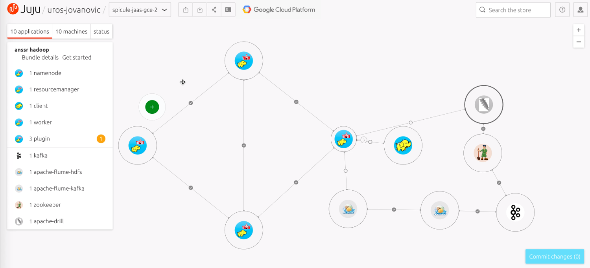
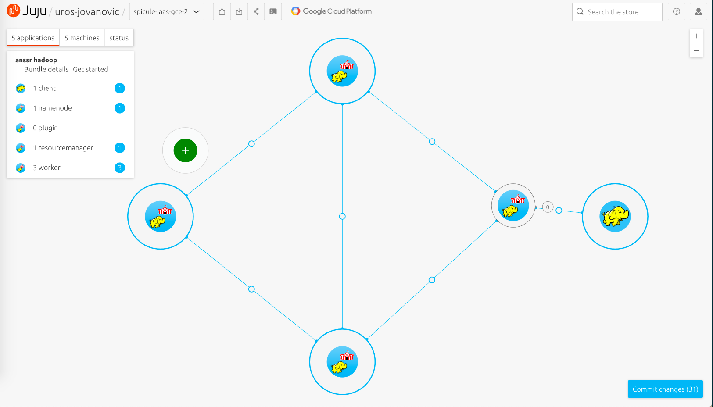
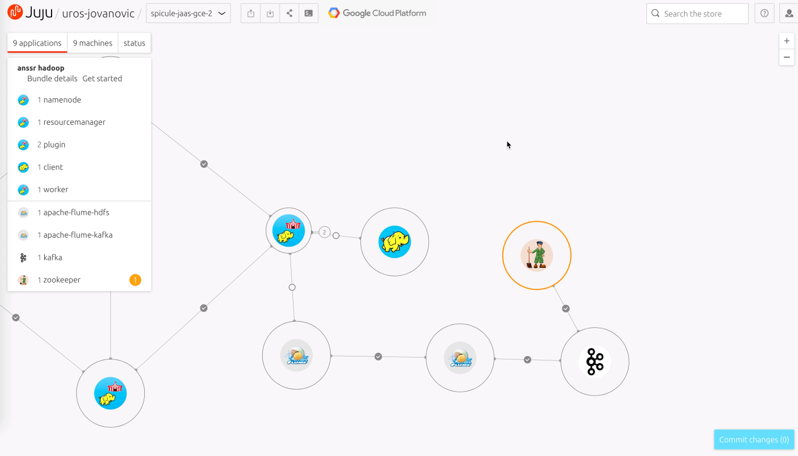
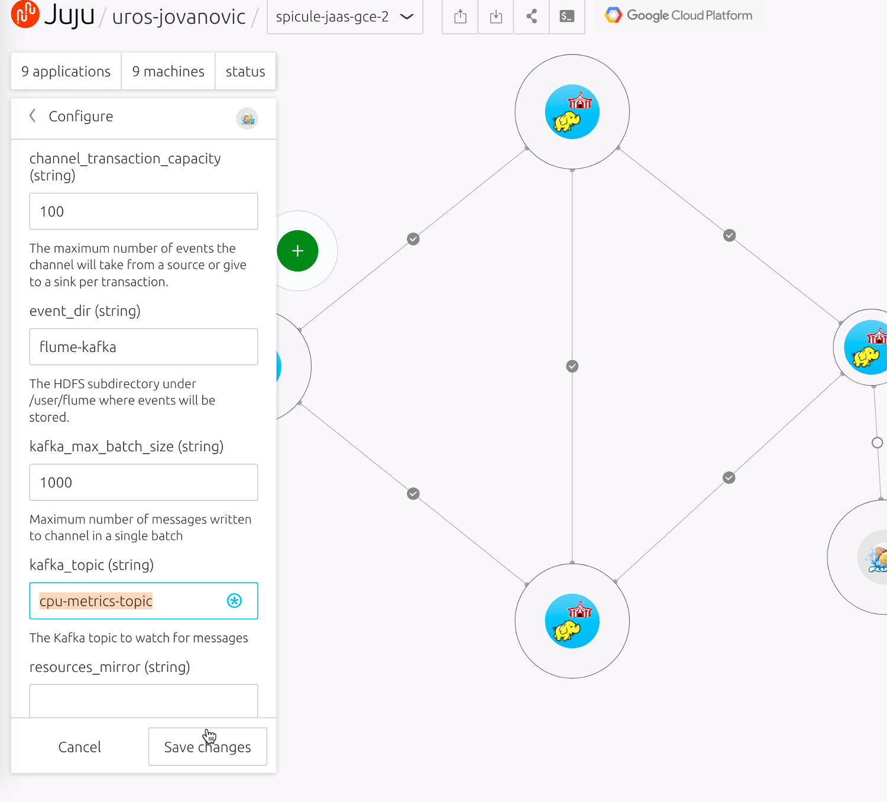
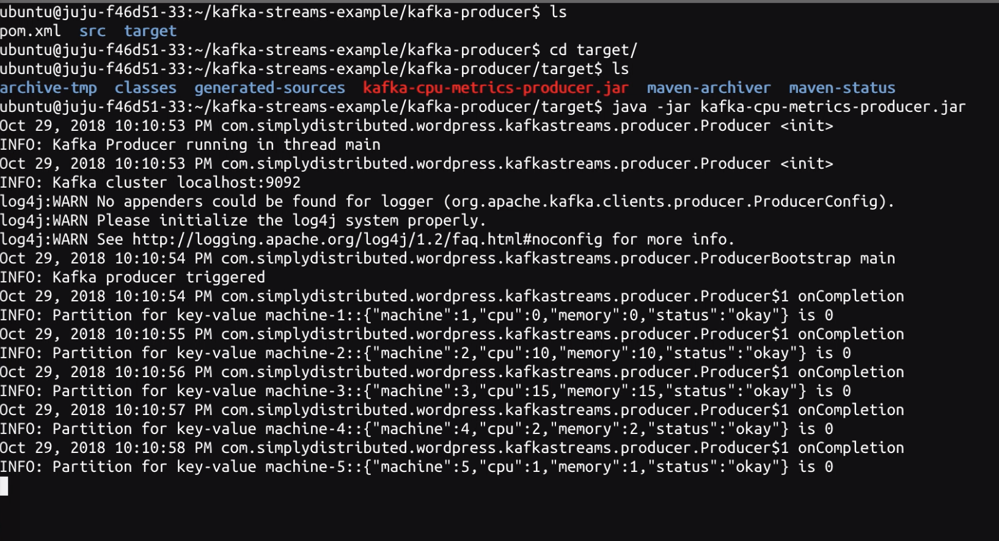
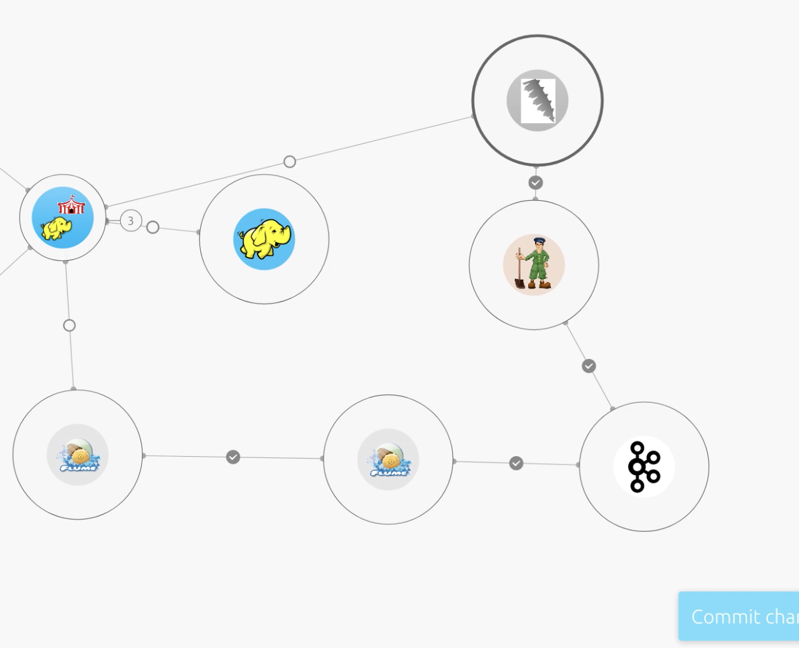
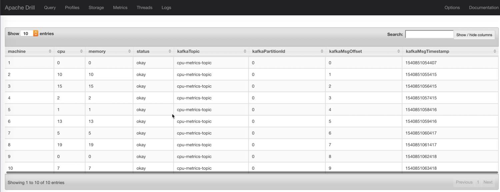
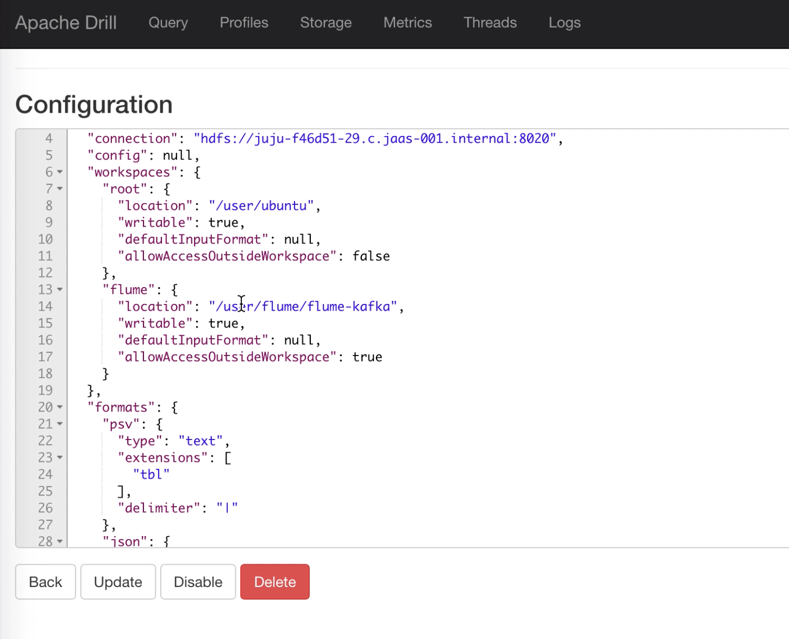

# Streaming Data Analytics with Apache Hadoop

## Overview
Duration: 2:00

### Introduction

Welcome to the first tutorial in this Anssr.io Getting Started with Data Processing series. 
Anssr.io is a data processing and analytics platform built on top of Juju from Canonical.

Streaming data processing is becoming more and more popular aided by faster computers, cheaper storage and open source projects like Apache Kafka which can deal with data streams at very high scale. Being able to process data in real time can both reduce the need for batch processing over much larger data sets and also give stakeholders quicker access to data that may otherwise take time to reach their computers.

Juju allows users to spin up complex applications onto different platforms and run the same code in each location. Whilst this tutorial is focussed on AWS, Azure or GCP, you could also run it on:

* Other cloud services
* OpenStack
* LXD containers
* MAAS

### In this tutorial you will learn how to....

* Launch a Hadoop cluster
* Deploy a Kafka server
* Connect Kafka to Hadoop
* Perform SQL analysis over your streaming data and the data stored in HDFS
* Create ultra fast Parquet files

### You will need...

* An Ubuntu One account
* A public SSH key
* Credentials for AWS, GCE or Azure

## Installing the Juju client
Duration: 5:00

Juju has both a web based GUI and a command line client. You can also access the command line from the GUI, but some people just prefer to use the comand line.

Juju is available as a client on many platforms and distributions. Visit the install docs to get the latest version of Juju on macOS, Windows or CentOS.

If you are running Ubuntu, you can install Juju through the following steps:

It's helpful to Install Snappy if you don't have it already.
    $ sudo apt install snapd

Install Juju to get the command line client.
    $ sudo snap install juju --classic

Verify you can run Juju. You will see a summary and a list of common commands.
    $ juju

You're all set!

## Connecting to Jaas
Duration: 2:00

To connect to JAAS from the command line you'll need to register with the JAAS controller. You will be required to do this just the first time.
    $ juju register jimm.jujucharms.com

This command will open a new window in your default web browser. Use Ubuntu SSO to login and authorise your account.
You will then be asked to enter a descriptive name for the JAAS controller. We suggest using jaas.
JAAS users with existing models, might first need to switch to the relevant model:
    $ juju switch <model-name>

Your Hadoop Spark cluster is managed as a model by Juju. View the model's status with:
    $ juju status

To watch continuously, in colour, run:
    $ watch -c juju status --color

## Deploying Hadoop with JAAS
Duration: 30:00

So in this tutorial we are going to be streaming Kafka data, but we need somewhere to store it. This could be local files, another database or S3 to name a few. But in this case we're going to persist the data into a HDFS cluster.

### Deploy via the Juju GUI

The easisest was to get going is via the GUI. 

Go to jujucharms.com and in the search the store box on the toolbar, enter the phrase, Anssr Hadoop. In the results bar you'll see a bundle, select this bundle and click on Add to new model in the top of the bundle page.

Once added to a new model, you can see the charms laid out on the canvas. You can see that it consists of 5 applications and by default 5 machines are used to deploy it.

The applications are the Namenode, Resource Manager, Workers, Client and Plugin. This is a fully working Hadoop stack and so once deployed will spin up 3 workers to distirbute the processing load, but as we're just testing here, we can keep costs down and reduce this to 1. To do this click on the Worker charm, this is the left hand most icon, and then in the top left you should see some details.

Click on Units, check 2 of the checkboxes and click the remove button.

Once you've done this click Commit changes.

If you've not logged into the charm store at this point you will be asked to Login or Sign up to Juju, this uses Ubuntu One, so if you've already got an account you can enter it here.

Next you will be asked where you want to deploy your Hadoop cluster. Depending on your cloud choices you can then select from AWS, Azure or GCP. You will need to enter your cloud credentials and its advised you upload your SSH key using the manual SSH key entry or use the Github or Launchpad key installers. Make sure you click the Add key button before moving on.

From there you then need to click the Commit button.

As machines get started and applications deployed, the charms on the canvas should get different coloured outlines to indicate their status. You can also find out more about their current state by clicking on the Status tab. When finished all the charms should be in the Active state with a ready status message.

### Deploy via CLI

If on the other hand you prefer using the CLI, this is how you do it.

First you need to add a model:

    juju add-model streaming <cloud name>

More details can be found [here](https://docs.jujucharms.com/2.4/en/jaas-cli#create-and-deploy-a-model)

Then you can deploy the model:

    juju deploy ~spiculecharms/anssr-hadoop

And scale down the workers for this tutorial:

    juju remove-unit -n 2 worker

To keep an eye on whats going on run:

    juju status

## Adding Kafka and Flume
Duration: 10:00

Once we have a Hadoop cluster up and running it's time to spin up our streaming pipeline. For this we will use a combination of Kafka and Flume.

### Deploy via GUI

Search the charm store for Kafka and add it to the canvas.

Then search for apache flume and add both the HDFS and Flume Kafka charms to the canvas.

Finally we need to create relations, so join Kafka to the Apache Flume Kafka charm and that charm to the Apache Flume HDFS charm. Once that's done connect the Apache Flume HDFS charm to the Hadoop Plugin charm. 

To make Kafka work, we also need a zookeeper charm so add that to the canvas and connect it to Kafka.

Next click the Deploy button, this will spin up the relevant machines and install the required software.

### Deploy via CLI

If you are a command line user you can use the following commands:

    juju deploy kafka
    juju deploy apache-flume-hdfs
    juju deploy apache-flume-kafka
    juju deploy zookeeper

    juju add-relation apache-flume-hdfs plugin
    juju add-relation kafka apache-flume-kafka
    juju add-relation apache-flume-hdfs apache-flume-kafka
    juju add-relation kafka zookeeper

### Configuring Flume and Kafka

Once all the units are up and running we then need to configure them so they know what data to process.

In the GUI, select the Flume Kafka charm and select the Configure option from the menu. Towards the bottom you'll see an entry for the kafka_topic. Set this to `cpu-metrics-topic` and then commit changes.

Next we have to use the command line, if you've not installed the CLI, you can click the shell icon at the top of the Juju GUI and get a shell in your browser. If you're using the CLI you're all set.

We create a Kafka topic running the following command:

    juju run-action kafka/0 create-topic topic=cpu-metrics partitions=1 replication=1

This runs a script on the Kafka server telling it to create a topic to stream data through.

You can check it runs by running:

    juju show-action-output <id> 

where `<id>` is the output from the previous command.

You should see something like:

    results:
      outcome: success
      raw: |
        Created topic "cpu-metrics-topic".
    status: completed
    timing:
      completed: 2018-10-26 09:39:10 +0000 UTC
      enqueued: 2018-10-26 09:39:06 +0000 UTC
      started: 2018-10-26 09:39:07 +0000 UTC

## Streaming some data
Duration: 5:00

Next we are going to stream some data into Kafka. For this we need a little script to generate some data. 

The easiest way to do this is to run it directly on the Kakfa server. To do that you need to SSH into the server:

    juju ssh kafka/0

Then you can either download this jar file,

    wget -O kafka-cpu-metrics-producer.jar https://www.dropbox.com/s/oczzh8iebo0u7sn/kafka-cpu-metrics-producer.jar?dl=1 

or compile it from source like so:
 
    git clone https://github.com/buggtb/kafka-streams-example
    sudo apt install maven
    cd kafka-streams-example 
    mvn clean package
    cd target

Next we can start the generator:

    java -jar kafka-cpu-metrics-producer.jar

You should see it starting to write a stream of data to the screen. This data is also being ingested into Kafka. In the next section we'll find out how to interrogate it.

## Watching the data
Duration: 2:00

So the data should be flowing from the generator, into Kafka, from Kafka into Flume and from Flume to HDFS. So lets verify it. 

    juju ssh resourcemanager/0
    hdfs dfs -ls /user/flume/flume-kafka/

You should see a date stamped folder. You can then run 

    hdfs dfs -ls /user/flume/flume-kafka/<yyyy-mm-dd>

to see the individual files in the kafka output.

This data could then be processed in a range of ways. MapReduce, Spark, Pig etc or in our case Apache Drill. 
Find out how to use SQL to process this data on the next page.

## Extending with Apache Drill
Duration: 5:00

Apache Drill allows users to run SQL queries over NoSQL data sources. Out of the box it has support for HDFS, standard filesystems, MongoDB, Kudu, Kafka and others.

To deploy it you can search for Apache Drill in the charm store. Add it to the canvas and relate it to the Zookeeper charm, Kafka charm and finally connect it to the Hadoop plugin charm and press the commit button. 

As this is a GUI based tool, we're also going to expose it. Select the charm, click on the Expose menu button, then expose the app. Make sure you press the Commit changes button afterwards.

Or if you are a CLI user run:
    
    juju deploy ~spiculecharms/apache-drill
    juju add-relation apache-drill zookeeper
    juju add-relation apache-drill plugin
    juju add-relation apache-drill kafka
    juju expose apache-drill

Once its deployed you're then you're ready to run some SQL goodness!

## Running SQL over a live stream
Duration: 5:00

To navigate to drill, find the IP in the Status tab and in a browser navigate to http://<ip>:8047. If it doesn't load ensure you "exposed" the service.
    
Because we related Apache Drill to Kafka, Juju will have automatically configured our DFS and Kafka datasources. If you navigate to Apache Drill in a browser you can see both are configured in the Storage tab, for example a Kafka data source should look similar to:

    {
      "type": "kafka",
      "kafkaConsumerProps": {
        "bootstrap.servers": "10.142.0.10:9092",
        "group.id": "drill-consumer"
      },
      "enabled": true
    }

This means we should then be able to query the stream. In the query tab, paste the following query:

    select * from kafka.`cpu-metrics-topic`  limit 10

If all is well you should see a table of 10 rows of data returned from the Kafka stream. This is SQL live over stream data!

## SQL over Hadoop HDFS
Duration: 5:00

You can also query the files being written by Flume into the HDFS cluster. 

So that Drill understands the files being written by Flume and also their location, you need to make a couple of minor tweaks to the juju_hadoop_plugin data source in Apache Drill.

Firstly in the top block below where it says root add: 

    "flume": {
      "location": "/user/flume/flume-kafka",
      "writable": true,
      "defaultInputFormat": null,
      "allowAccessOutsideWorkspace": true
    }

Then amend the JSON block:

    "json": {
      "type": "json",
      "extensions": [
        "json",
        "txt"
      ]
    },

Once you've updated the data source, click on the Query tab.

Then you can run the following query:

    select * from `juju_hdfs_plugin`.`flume`.`[yyyy-MM-dd]`
    
Where yyyy-MM-dd is the current date.

This data is processed from the log files written by Flume into HDFS and eventually could be many Terabytes worth of data. The great thing about Apache Drill is the fact that it'll piece together multiple files in a directory into a single table, so although Flume is writing individual files over time, Drill will treat them all as one.

## Writing your data to a Parquet file
Duration: 3:00

Executing complex SQL queries over JSON files can be pretty slow as the data scales. So how can we speed this up? 

Parquet is a binary based file format that allows you to create column store data structures. Column store databases have been used for decades to speed up query times in reporting databases, they are generally quicker as the database doesn't have to consume an entire row when crunching its data. 

Apache Drill can query Parquet files, which is cool. But it can also create Parquet files. Which is even cooler. Lets give it a go!

Execute the following query: 

    CREATE TABLE dfs.tmp.sampleparquet AS 
    (select machine, cast(cpu as double) cpu, cast(memory as double) memory, status from `juju_hdfs_namenode`.`flume`.`yyyy-MM-dd`)

Where yyyy-MM-dd is the current date.
This runs a CREATE TABLE statement from a SQL Select statement and will write the output as a Parquet file. The CREATE TABLE statement is pretty flexible and allows you to create table structures in a range of data formats. You could also extend this to enrich your data by combining multiple queries or datasources in your query to enable greater visibility of your data.

Find out how to query it next!

## Extended data analysis
Duration: 5:00

Finally for this tutorial, now we're writing out Parquet files, you need to be able to query them, right?

Drill has written this one to the Hadoop temporary location where it has write access. To read it you can run queries like the following:

    select * from dfs.tmp.sampleparquet

This allows you to run an SQL query directly over a Parquet table structure. Because Parquet is a binary format, you can't just go and look in the file, you need an application to process that data, Druid does this for you. But Druid also knows how to structure the query in such a way that the data is returned in the fastest way possible.

## Where next?!
Duration: 2:00

Hopefully you've enjoyed this tutorial about the Anssr platform and how to get more out of your data.

In this tutorial you've,

* Deployed a Hadoop cluster
* Wired up Apache Drill
* Spun up Kafka and connected it to Flume

Then you

* Ran SQL queries over flat files
* Ran SQL queries over Kafka streams
* Generated and queried Parquet files

Not bad considering how little command line interaction is required. This demonstrates just some of the flexibility of the Anssr platform.

What next? How about Machine Learning? Complex Event Processing? Streaming Analytics? All can be achieved using Anssr and the Juju engine.

If you have any more comments or questions, you can find more help and support on the [Juju forums](http://discourse.jujucharms.com/). Or via the Spicule [Juju Expert Partners](https://jujucharms.com/experts/spicule) page.
