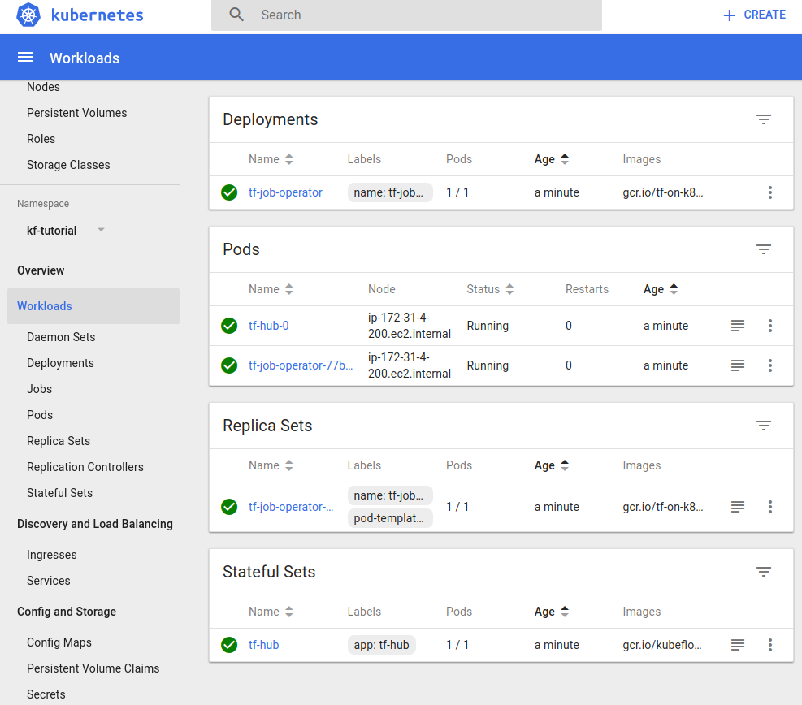
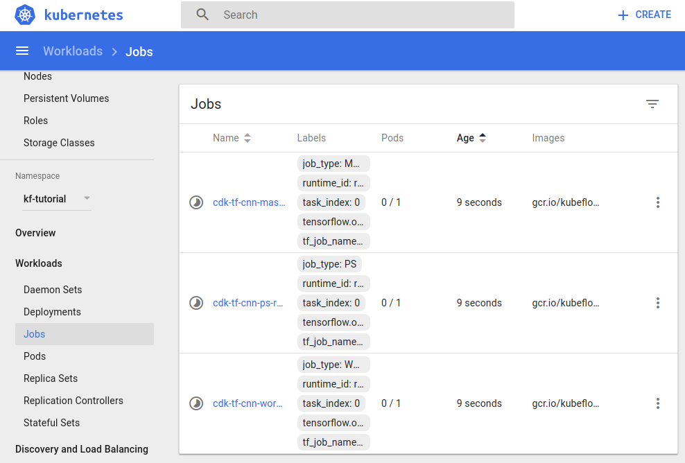

# Getting started with KubeFlow

## Overview
Duration: 2:00

This tutorial will guide you through installing [KubeFlow](https://github.com/google/kubeflow) on top of the [Canonical Distribution of Kubernetes (CDK)](https://www.ubuntu.com/kubernetes) using conjure-up. We will use Amazon AWS to deploy CDK  and deploy KubeFlow using ksonnet. Finally, we will test our KubeFlow installation by submitting a sample job and verifying that the GPU is being used.

### KubeFlow

KubeFlow is an open source project dedicated to providing easy to use Machine Learning (ML) resources on top of a Kubernetes cluster. Most prominently, KubeFlow eases the installation of [Tensorflow](https://www.tensorflow.org/) and provides the mechanisms for leveraging GPUs attached to the underlying host in the execution of ML jobs submitted to it.

### What you'll learn

- how to create GPU workers in CDK using conjure-up
- how to install KubeFlow using Ksonnet
- how to run your first job on KubeFlow using those GPU resources

### What you'll need

- Amazon Web Services account credentials
- ability to provision [AWS EC2 P2 instances](https://aws.amazon.com/ec2/instance-types/p2/)
- general knowledge of how to [deploy Kubernetes using conjure-up](https://tutorials.ubuntu.com/tutorial/install-kubernetes-with-conjure-up)
- [Ksonnet](https://github.com/ksonnet/ksonnet) installed and ready to be used

Survey
: How will you use this tutorial?
 - Only read through it
 - Read it and complete the exercises
: What is your current level of experience?
 - Novice
 - Intermediate
 - Proficient

## Create your CDK Cluster
Duration: 8:00

In order for us to provision GPU-enabled workloads such as TensorFlow on top of Kubernetes, we need to provision worker nodes in the appropriate instance type.

### Deploy a GPU-enabled Kubernetes Worker

For this tutorial, we will start with a dedicated CDK cluster to run our Machine Learning workloads on top of TensorFlow. By default, ``conjure-up canonical-kubernetes`` will instantiate the kubernetes-worker nodes as ``m3.medium``, which is not what we need in our case.

We will therefore create a bundle snippet called ``cdk-gpu-worker.yaml`` with the following contents:

```yaml
services:
  "kubernetes-worker":
    charm: "cs:~containers/kubernetes-worker"
    num_units: 1
    options:
      channel: 1.8/stable
    expose: true
    constraints: "instance-type=p2.xlarge root-disk=32768"
```

This will ensure we have the right instance flavors available for our Kubernetes worker node, and enough root-disk space to hold the CUDA libraries, as well as the GPU-enabled TensorFlow container image.

Kick off the deployment of your cluster:

```bash
$ conjure-up --bundle-add cdk-gpu-worker.yaml canonical-kubernetes
```

You might have to add your AWS credentials in order to be able to use AWS as target cloud environment. We are using aws/us-east-1 as it has the ``p2.xlarge`` flavors available.

After the installation is complete, copy the K8s configuration file locally:

```bash
$ juju scp kubernetes-master/0:config ~/.kube/config
```

## Installing KubeFlow using Ksonnet
Duration: 5:00

Now that we have a Kubernetes cluster up and running, we will deploy KubeFlow to it. The KubeFlow project is a relatively new community spun out of the Kubernetes project and aims to make machine learning developer workflows easy.

We prepare our Ksonnet deployment "kf-tutorial" and add the necessary packages to it. To keep things clean and tidy, we create a dedicated Kubernetes namespace, and tie that to our Ksonnet deployment as an environment which we'll call "cdk":


```bash
$ kubectl create namespace kf-tutorial
$ ks init kf-tutorial && cd kf-tutorial
$ ks env add cdk
$ ks registry add kubeflow github.com/google/kubeflow/tree/master/kubeflow
$ ks pkg install kubeflow/core
$ ks pkg install kubeflow/tf-serving
$ ks pkg install kubeflow/tf-job
```

Ksonnet will pick up the configuration in our local ``~/.kube/config`` and prepare the environment for us. We can then proceed to apply the parameters to the prototypes and deploy the KubeFlow core components (JupyterHub and the TensorFlow job controller):

```bash
$ ks generate core kubeflow-core --name=kubeflow-core --namespace=kf-tutorial
$ ks apply cdk -c kubeflow-core
```

You should see some informational messages confirming the deployment. Let's look at the Kubernetes Dashboard to verify. It should look similar to this (note the namespace "kf-tutorial"):



If you like, you can already access KubeFlow through the JupyterHub by visiting the EXTERNAL-IP address for the tf-hub-lb service:

```bash
$ kubectl get services --namespace=kf-tutorial
NAME        TYPE           CLUSTER-IP       EXTERNAL-IP        PORT(S)        AGE
tf-hub-0    ClusterIP      None             <none>             8000/TCP       7m
tf-hub-lb   LoadBalancer   10.152.183.118   ace3eaaf2e457...   80:32456/TCP   6m
```

However we are not done! Part of the appeal of using Kubernetes together with TensorFlow is the ability to submit your own TF jobs directly through the Kubernetes API. We will leverage the Custom Resource Definition (CRD) feature of Kubernetes to provide that. Luckily, the KubeFlow Core installation step already created the CRD so we can immediately submit models as Ksonnet components by using the generate/apply pair of commands:

```bash
$ ks generate tf-cnn kubeflow-test --name=cdk-tf-cnn --namespace=kf-tutorial
$ ks apply cdk -c kubeflow-test --namespace=kf-tutorial
```

You can see that a resource of type "tfjob" was submitted into the "kf-tutorial" namespace:
```bash
$ kubectl get tfjobs --namespace=kf-tutorial
NAME         AGE
cdk-tf-cnn   1m
```

You can also find the three components of the TensorFlow job (Master, Parameter Server and Worker) in the "Jobs" section of your Kubernetes Dashboard:



Once all pods have been deployed, we can verify the CNN job is running properly by inspecting the logs of the worker pod:

```bash
$ kubectl logs --namespace=kf-tutorial -f cdk-tf-cnn-worker-rptp-0-wjdph
--snip--
INFO|2017-12-19T01:12:17|/opt/launcher.py|27| TensorFlow:  1.5
INFO|2017-12-19T01:12:17|/opt/launcher.py|27| Model:       resnet50
INFO|2017-12-19T01:12:17|/opt/launcher.py|27| Mode:        training
INFO|2017-12-19T01:12:17|/opt/launcher.py|27| SingleSess:  False
INFO|2017-12-19T01:12:17|/opt/launcher.py|27| Batch size:  32 global
INFO|2017-12-19T01:12:17|/opt/launcher.py|27| 32 per device
INFO|2017-12-19T01:12:17|/opt/launcher.py|27| Devices:     ['/job:worker/task:0/cpu:0']
INFO|2017-12-19T01:12:17|/opt/launcher.py|27| Data format: NHWC
INFO|2017-12-19T01:12:17|/opt/launcher.py|27| Optimizer:   sgd
INFO|2017-12-19T01:12:17|/opt/launcher.py|27| Variables:   parameter_server
INFO|2017-12-19T01:12:17|/opt/launcher.py|27| Sync:        True
INFO|2017-12-19T01:12:17|/opt/launcher.py|27| ==========
INFO|2017-12-19T01:12:17|/opt/launcher.py|27| Generating model
INFO|2017-12-19T01:12:21|/opt/launcher.py|27| 2017-12-19 01:12:21.230800: I tensorflow/core/distributed_runtime/master_session.cc:1008] Start master session 8ba56f373a0872fb with config: intra_op_parallelism_threads: 1 gpu_options { force_gpu_compatible: true } allow_soft_placement: true
INFO|2017-12-19T01:12:22|/opt/launcher.py|27| Running warm up
```

There it is! Congratulations, you have successfully run KubeFlow on top of CDK on AWS. However, is it actually using the GPU? Let's check:

```bash
$ ks show cdk -c kubeflow-test
---
apiVersion: tensorflow.org/v1alpha1
kind: TfJob
metadata:
  name: cdk-tf-cnn
  namespace: kf-tutorial
spec:
  replicaSpecs:
  - replicas: 1
    template:
      spec:
        containers:
        - args:
          - python
          - tf_cnn_benchmarks.py
          - --batch_size=32
          - --model=resnet50
          - --variable_update=parameter_server
          - --flush_stdout=true
          - --num_gpus=1
          - --local_parameter_device=cpu
          - --device=cpu
          - --data_format=NHWC
          image: gcr.io/kubeflow/tf-benchmarks-cpu:v20171202-bdab599-dirty-284af3
          name: tensorflow
          workingDir: /opt/tf-benchmarks/scripts/tf_cnn_benchmarks
        restartPolicy: OnFailure
    tfReplicaType: MASTER
  - replicas: 1
    template:
      spec:
        containers:
        - args:
          - python
          - tf_cnn_benchmarks.py
          - --batch_size=32
          - --model=resnet50
          - --variable_update=parameter_server
          - --flush_stdout=true
          - --num_gpus=1
          - --local_parameter_device=cpu
          - --device=cpu
          - --data_format=NHWC
          image: gcr.io/kubeflow/tf-benchmarks-cpu:v20171202-bdab599-dirty-284af3
          name: tensorflow
          workingDir: /opt/tf-benchmarks/scripts/tf_cnn_benchmarks
        restartPolicy: OnFailure
    tfReplicaType: WORKER
  - replicas: 1
    template:
      spec:
        containers:
        - args:
          - python
          - tf_cnn_benchmarks.py
          - --batch_size=32
          - --model=resnet50
          - --variable_update=parameter_server
          - --flush_stdout=true
          - --num_gpus=1
          - --local_parameter_device=cpu
          - --device=cpu
          - --data_format=NHWC
          image: gcr.io/kubeflow/tf-benchmarks-cpu:v20171202-bdab599-dirty-284af3
          name: tensorflow
          workingDir: /opt/tf-benchmarks/scripts/tf_cnn_benchmarks
        restartPolicy: OnFailure
    tfReplicaType: PS
tfImage: gcr.io/kubeflow/tf-benchmarks-cpu:v20171202-bdab599-dirty-284af3
```

As you can see, there are no GPUs being used (the parameter ``--device=cpu`` indicates this and forces the usage of the cpu version of the docker image). Let's deploy it again, this time enabling GPUs to be used. Clean up the current CPU-only job execution before moving on to the next section:

```bash
$ ks delete cdk -c kubeflow-test --namespace=kf-tutorial
```

## Running a TensorFlow job with GPU-support enabled
Duration: 4:00

In order to instruct KubeFlow to request a GPU to compute the CNN, we need to take a look at the Ksonnet tf-cnn prototype parameters:

```bash
$ ks param list | grep kubeflow-test
kubeflow-test batch_size  32
kubeflow-test image       "gcr.io/kubeflow/tf-benchmarks-cpu:v20171202-bdab599-dirty-284af3"
kubeflow-test image_gpu   "gcr.io/kubeflow/tf-benchmarks-gpu:v20171202-bdab599-dirty-284af3"
kubeflow-test model       "resnet50"
kubeflow-test name        "cdk-tf-cnn"
kubeflow-test namespace   "kf-tutorial"
kubeflow-test num_gpus    0
kubeflow-test num_ps      1
kubeflow-test num_workers 1
```

As you can see, there is a variable called ``num_gpus`` which is set to 0. Let's set the parameter to "1" and apply the parameters again:

```bash
$ ks param set cdk kubeflow-test num_gpus 1
$ ks apply cdk -c kubeflow-test --namespace=kf-tutorial
```

Try to verify that the parameter was successfully set. If so we're ready to apply the parameters to the Ksonnet prototype and create a TfJob component utilizing the GPU on the p2.xlarge instance:

```bash
$ ks apply cdk -c kubeflow-test-gpu --namespace=kf-tutorial
```

Let's check whether the GPU is actually being used:

```bash
$ ks show cdk -c kubeflow-test
---
apiVersion: tensorflow.org/v1alpha1
kind: TfJob
metadata:
  name: cdk-tf-cnn
  namespace: kf-tutorial
spec:
  replicaSpecs:
  - replicas: 1
    template:
      spec:
        containers:
        - args:
          - python
          - tf_cnn_benchmarks.py
          - --batch_size=32
          - --model=resnet50
          - --variable_update=parameter_server
          - --flush_stdout=true
          - --num_gpus=1
          image: gcr.io/kubeflow/tf-benchmarks-gpu:v20171202-bdab599-dirty-284af3
          name: tensorflow
          workingDir: /opt/tf-benchmarks/scripts/tf_cnn_benchmarks
        resources:
          limits:
            nvidia.com/gpu: 1
        restartPolicy: OnFailure
    tfReplicaType: MASTER
  - replicas: 1
    template:
      spec:
        containers:
        - args:
          - python
          - tf_cnn_benchmarks.py
          - --batch_size=32
          - --model=resnet50
          - --variable_update=parameter_server
          - --flush_stdout=true
          - --num_gpus=1
          image: gcr.io/kubeflow/tf-benchmarks-gpu:v20171202-bdab599-dirty-284af3
          name: tensorflow
          workingDir: /opt/tf-benchmarks/scripts/tf_cnn_benchmarks
        resources:
          limits:
            nvidia.com/gpu: 1
        restartPolicy: OnFailure
    tfReplicaType: WORKER
  - replicas: 1
    template:
      spec:
        containers:
        - args:
          - python
          - tf_cnn_benchmarks.py
          - --batch_size=32
          - --model=resnet50
          - --variable_update=parameter_server
          - --flush_stdout=true
          - --num_gpus=1
          image: gcr.io/kubeflow/tf-benchmarks-cpu:v20171202-bdab599-dirty-284af3
          name: tensorflow
          workingDir: /opt/tf-benchmarks/scripts/tf_cnn_benchmarks
        restartPolicy: OnFailure
    tfReplicaType: PS
tfImage: gcr.io/kubeflow/tf-benchmarks-cpu:v20171202-bdab599-dirty-284af3
```

Congratulations! You're ready to rock'n roll using KubeFlow on CDK!

## Next Steps
Duration: 2:00

The goal of this tutorial was to get you up and running quickly using KubeFlow. As we verified the installation, we submitted a sample job, called ``tf-cnn``, which executes High Performance Benchmarks, an implementation of several convolutional neural network models. In order to create your own job executing your own code, you need to manually create a ``tf-job`` resource and fill the parameters accordingly, including linking to the right docker image.

Recommended reading:

* [TensorFlow](https://www.tensorflow.org/)
* [Kubeflow](https://github.com/google/kubeflow)
* [TensorFlow: CNN Benchmarks](https://github.com/tensorflow/benchmarks/tree/master/scripts/tf_cnn_benchmarks)
* [Creating a Custom TfJob to serve a TF model](https://github.com/jlewi/kubeflow/blob/28fd44ca51075d9c5c3b4784a1224f480075d5cb/README.ksonnet.md#serve-a-model)
* [Ksonnet](https://ksonnet.io/) - A CLI-supported framework for extensible Kubernetes configurations
