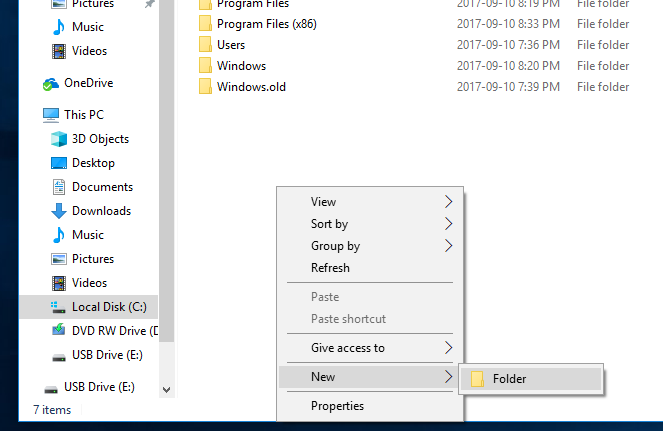
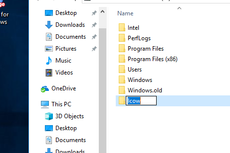
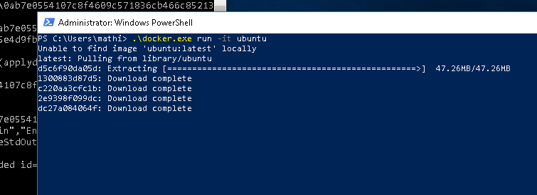
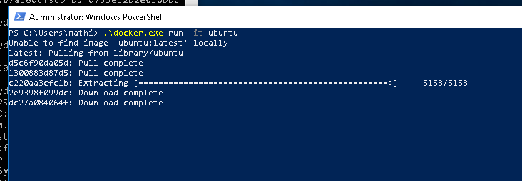

# Run Linux containers on Windows
Duration: 1:00

## Overview

It is now possible to run Docker containers on Windows 10 and Windows Server, leveraging Ubuntu as a hosting base.

Imagine running your own Linux applications on Windows, using a Linux distribution you are comfortable with: Ubuntu!

It is now possible to do so using the power of Docker technology and Hyper-V virtualization on Windows.


## Requirements
Duration: 5:00

You will need a 64-bit x86 PC with 8GiB of RAM running Windows 10 or Windows Server, updated to include the [Windows 10 Fall Creator update][win10fall], released October 2017.
 
You will also need a recent installation of Docker, which can be downloaded from [http://dockerproject.org](http://dockerproject.org).

Finally, you will need to make sure you have installed a program for decompressing the Ubuntu host container image, e.g. [7-Zip](http://7-zip.org/) or [XZ Utils](https://tukaani.org/xz/)

## Install Docker for Windows
Duration: 2:00

Download Docker for Windows from [Docker Store](https://store.docker.com/editions/community/docker-ce-desktop-windows).


Once downloaded, proceed with the installation steps, and either logout or reboot of your system as indicated by the installer.


After reboot, Docker will be started. Docker requires that the Hyper-V feature is enabled, so if necessary will ask you to enable it and restart. Click *OK* for Docker to enable Hyper-V and restart your system.


## Download the Ubuntu container image
Duration: 4:00

Download the latest Ubuntu container image for Windows from the [Canonical Partner Images website](https://partner-images.canonical.com/hyper-v/linux-containers/xenial/current/)

Once downloaded, extract the image, using e.g. 7-Zip, or XZ Utils:
```bash
C:\Users\mathi\> .\xz.exe -d xenial-container-hyper-v.vhdx.xz
```

## Prepare the container environment
Duration: 2:00

First, create two directories:



Create *C:\lcow*, which will be used as scratch space for Docker while preparing the containers.



Also create *C:\Program Files\Linux Containers*. This is where the Ubuntu container image will live.

You will need to give this folder extra permissions to allow Docker to use the images from it.  Run the following Powershell script in an administrator Powershell window:

```powershell
param(
[string] $Root
)
# Give the virtual machines group full control
$acl = Get-Acl -Path $Root
$vmGroupRule = new-object System.Security.AccessControl.FileSystemAccessRule("NT VIRTUAL MACHINE\Virtual Machines", "FullControl","ContainerInherit,ObjectInherit", "None", "Allow")
$acl.SetAccessRule($vmGroupRule)
Set-Acl -AclObject $acl -Path $Root
```

Save this file as *set_perms.ps1* and run it:

positive
: **TIP** You may need to run 'Set-ExecutionPolicy -Scope process unrestricted' to be allowed to run unsigned Powershell scripts.


```bash
C:\Users\mathi\> .\set_perms.ps1 "C:\Program Files\Linux Containers"
C:\Users\mathi\>
```

Now, copy the Ubuntu container image *.vhdx* file that was decompressed at the previous step to *uvm.vhdx* under *C:\Program Files\Linux Containers*.


## More Docker preparation
Duration: 2:00

Docker for Windows requires some pre-release features in order to work with Hyper-V isolation. While these features are not yet available in the Docker CE installation that was done previously, the necessary files can be downloaded from [master.dockerproject.org](https://master.dockerproject.org).


Retrieve *dockerd.exe* and *docker.exe* from [master.dockerproject.org](https://master.dockerproject.org), and put the two programs somewhere safe, such as in your own folder. They will be used to start the Ubuntu container in the next step.


## Run an Ubuntu container on Hyper-V
Duration: 3:00

You're now ready to start your container. First, open a Command-line prompt (*cmd.exe*) as Administrator, and start *dockerd.exe* with the right environment:

```bash
C:\Users\mathi\> set LCOW_SUPPORTED=1
C:\Users\mathi\> .\dockerd.exe -D --data-root C:\lcow
```

negative
: **Docker already running?**
If the Docker installer sets Docker to run automatically at boot, you may need to quit the already running daemon via its toolbar icon before running the above commands.

Then, start a Powershell window as Administrator; and run *docker.exe*, instructing it to pull the image for your container:

```bash
C:\Users\mathi\> .\docker.exe pull ubuntu
```





We can now finally start the container. Run *docker.exe* again, and tell it to run the new image:

```bash
C:\Users\mathi\> .\docker.exe run -it ubuntu
```


Congratulations! You have successfully set up your system to use containers with Hyper-V isolation on Windows, and have run your very own Ubuntu container.

## Getting help
Duration: 1:00

If you need some guidance getting started with the Ubuntu container images for Hyper-V, or if you get stuck, help is always at hand:

* [Ask Ubuntu][askubuntu]
* [Ubuntu Forums][forums]
* [IRC-based support][ubuntuirc]

<!-- LINKS -->
[msubuntu]: https://www.microsoft.com/en-us/store/p/ubuntu/9nblggh4msv6
[getstartedcli]: https://help.ubuntu.com/community/UsingTheTerminal
[windowsinsider]: https://insider.windows.com/en-us/
[storelink]: ms-windows-store://pdp/?productid=9NBLGGH4MSV6&referrer=unistoreweb&scenario=click&webig=11a9a85f-44f0-4cf5-ac1f-d9e148f2c23b&muid=01A3F9D8DEC2605B1426F331DF03617B
[win10fall]: https://support.microsoft.com/en-gb/help/4028685/windows-10-get-the-fall-creators-update 
[askubuntu]: https://askubuntu.com/
[forums]: https://ubuntuforums.org/
[ubuntuirc]: https://wiki.ubuntu.com/IRC/ChannelList
