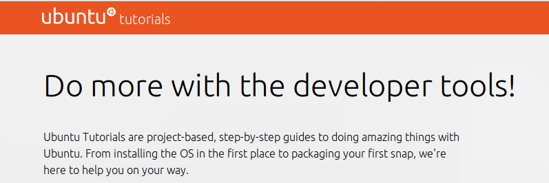
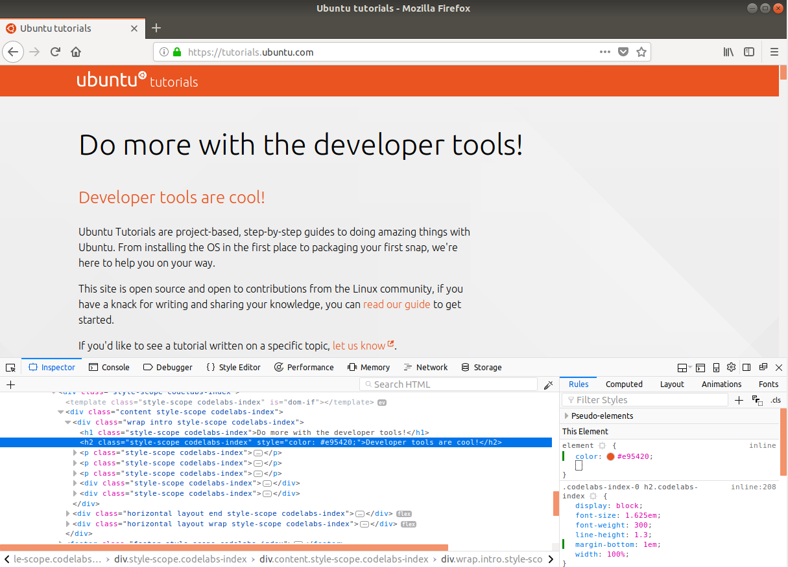
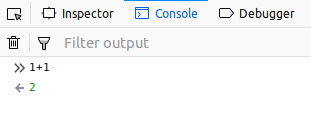
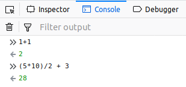
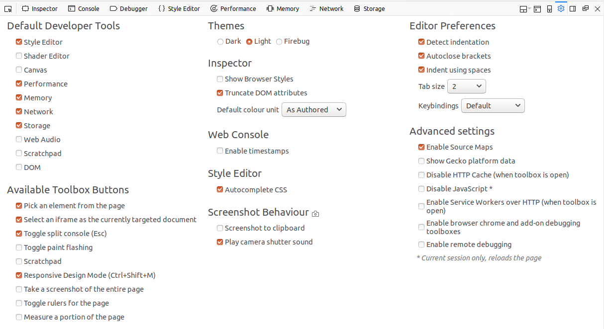
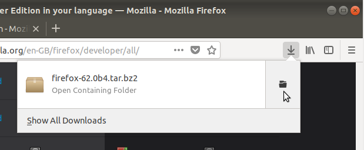
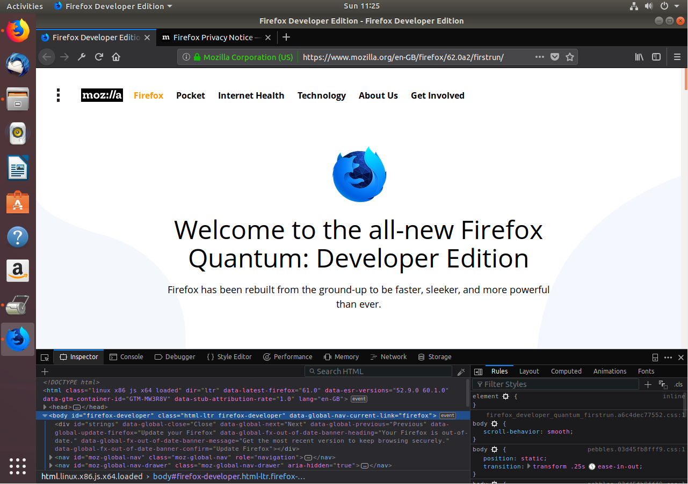

# Firefox for web developers

## Overview
Duration: 1:00

In this tutorial you will learn how to access the web development tools that are built into every copy of Firefox. You will also learn how to install the Firefox Developer Edition alongside your normal Firefox installation, allowing you to keep development work separate from your normal day-to-day browsing.


### What you'll learn
* How to access the developer tools
* How to use the inspector and console tools
* How to configure the user interface to show the tools you want
* Why you might want to install a second browser for development
* How to install Firefox Developer Edition


### What you'll need
* A computer running Ubuntu 16.04 or above
* The Firefox web browser (installed by default in Ubuntu desktop systems)


negative
: **Breaking things is easy… but so is fixing them**
Using the developer tools can render a web page unusable. Don't worry if you do break something, just refresh the browser by pressing **F5** to reload the page in its original state.


## Opening the developer tools
Duration: 5:00

Every copy of Firefox has a suite of developer tools built right into the browser (as do Chrome, Safari, Edge and most other modern browsers). There's nothing you need to add, no extensions to download, no hidden preferences to change. That's one of the things that makes web development so compelling — you've already got everything you need to get started!

For this tutorial you need to be running Firefox — although the skills you'll learn are applicable to other browsers, too. If you're already using Firefox to read this tutorial, that's great. But if you're using a different browser you should start Firefox now.

You can use the developer tools to inspect any web page, but for now let's take a look at the main page of Canonical's tutorials site. If you're reading this in Firefox, **right-click** on the link below, and select **Open Link in New Window** from the context menu. If you're using another browser, copy the link address below and paste it into the address bar of your Firefox window.

[https://tutorials.ubuntu.com/](https://tutorials.ubuntu.com/)

You don't ***have*** to open a page in a new window to use the developer tools, but it will make it easier when switching back and forth to this tutorial. If you'd rather open the link in a new tab, that will work equally well.

There are several ways to access the developer tools and which you use is largely down to personal preference. Let's start with the most obvious and discoverable: via the menu.

### The Web Developer menu ###
Open the main Firefox menu using the button at the top right of the window. Towards the bottom of the menu you should see an entry labelled **Web Developer**. Clicking this will open the submenu that holds a list of all the developer tools.

The most useful are those in the top section of the menu, but the only one you really need to use is the first, **Toggle Tools**. Select this menu entry and the developer tools panel will open — usually at the bottom of the browser window, but it could be at the side, or even in a separate window. You can switch between all three options using the buttons at the top right of the panel. In this tutorial we'll work with the tools docked to the bottom of the window, so your browser should look something like this:


As you can see there are several tabs along the top edge of the developer tools panel. The tabs contains different tools, each focusing on a slightly different aspect of web development. The **Toggle Tools** menu entry opens the panel in the same state that it was in when you last closed it. The other entries in the top section of the **Web Developer** menu are just shortcuts to open the panel with a particular tab already selected.

If you move your mouse to the top of the developer tools panel you should find that the cursor changes to a double-headed arrow. When it's in this state you can click and hold the mouse button then drag up and down to adjust the split between the web page and the panel. During development you sometimes need to see more of the web page, and sometimes want to have more content visible in the tools, so feel free to dynamically change the height of the panel whenever you want.

Let's close the panel and look at the second way of opening it. Open the main Firefox menu, navigate to the **Web Developer** submenu and click the **Toggle Tools** option again. As the name suggests this will toggle the state of the panel, opening it if it's currently closed, and closing it if it's currently open. There's also a close button at the top right of the developer tools panel, which is usually more convenient than drilling into the menus.


### Using the keyboard ###
If you return to the **Web Developer** menu you'll notice that each tool has an associated keyboard shortcut. If you find yourself frequently using one particular tool, it might be worth learning the shortcut to jump straight to it.

The **Toggle Tools** entry has a shortcut of **Ctrl-Shift-I**. Go on, give it a try. Each time you press it, the panel will be opened or closed, depending on its previous state. For historical reasons there's also another shortcut that will do the same thing, and which is often easier to use if you have a full-sized keyboard: the **F12** key. Pressing **F12** then selecting a particular tool with the mouse is usually faster than navigating directly to it using the **Web Developer** menu, hence why most of the entries in that menu are rarely used.


### Using the context menu ###
There is a third way to open the developer tools. This is not a toggle, as it always switches to a particular tab, but is a very common approach when you want to take a closer look at a specific element on the web page. If you right-click on something in the page to open the context menu, you'll find an entry labelled **Inspect Element** towards the bottom. You can select this to open the developer tools with the **Inspector** tab active and the element you clicked on already highlighted within the panel. Let's give it a try:

1. Right click on the "Do more with Ubuntu!" heading near the top of the web page.
2. Select **Inspect Element** from the context menu.
3. The developer tools should open with the Inspector tab selected and the `<h1>` element highlighted.


As you can see, this method cuts right through the layers of HTML content to highlight the specific element that you right-clicked on, making this a very convenient way to open the tools if you need to work on a particular part of the page.


## The inspector##
Duration: 8:00

All the tabs in the developer tools panel have their uses, but for beginners to web development — or anyone who is simply curious about how a web page works — you only really need to use the **Inspector** and the **Console**. This section and the next will describe them in a little more detail.

The inspector lets you look at the details of the web page's "Document Object Model" (DOM). This is the browser's internal version of the page structure, and the inspector exposes it in a way that makes it look similar to the HTML that was used to create the page. Be clear, though, that although the DOM is initially created from the HTML, it's not quite the same thing. The DOM is a live representation of the page structure, so if the page content has been dynamically modified by some JavaScript code the changes will be reflected in the DOM, and hence in the inspector. The live nature of the DOM also means that you can change things in the inspector and see the results in real-time on the page — ideal for interactively tweaking the design of your page.

Let's play around with the Ubuntu Tutorials page a little. Don't worry, nothing you do in the inspector can be saved back to the Ubuntu servers, so your changes will only last until you reload the page and won't affect anyone else. The same applies to any other page — the developer tools let you tweak your page interactively, but those changes won't stick unless they're also applied to the original source code on the server.

Begin by right-clicking on the "Do more with Ubuntu!" heading and selecting **Inspect Element** from the context menu to highlight the `<h1>` element in the inspector (you might already be in this position from the previous section, but it won't hurt to do it again to be sure). As a reminder, here's how the developer tools should look at this point:


The inspector is divided into two main sections. The large area on the left shows the DOM as a tree structure. Each HTML element is represented as a line in the tree, indented to show its position in the page structure. Container elements are marked with a triangle to the left which can be clicked to hide or reveal the child elements within them. The smaller section on the right contains further details about the CSS rules applied to the element that is currently highlighted. This section also has several tabs presenting different tools for working with the CSS rules.

Without clicking any buttons, move your mouse up and down the DOM tree in the main section. Notice how the elements in the web page are highlighted as you move over the corresponding entry in the DOM. Clicking on a DOM entry will select it, updating the section on the right to show the CSS rules that now apply.

### Your first page edit ###
With the `<h1>` selected again, take a closer look at its entry in the DOM. Notice that the "Do more with ubuntu!" string is visible within the inspector. Double click on it and you are able to edit the value to say something different. Let's change it to read "Do more with the developer tools!", then press Enter to finish editing. Immediately the web page updates:



There are more editing options available from the context menu. Right-click on the `<h1>` element in the DOM tree and select **Duplicate Node**. As you might expect this duplicates the current node so we end up with two identical headings. Double-click on the `<h1>` tag at the start of the new element and change it to `<h2>` (to turn it into a second-level heading), then edit the content to read "Developer tools are cool!".

Our edited page is looking good, but there's a bit too much of a gap between the new `<h2>` and the paragraph below it. With the `<h2>` selected in the DOM tree, take a look at the **Rules** tab in the right-hand section:


The CSS rules include an entry that's setting the `margin-bottom` property to `2.25em`. Move the mouse over any rule and you'll see that checkboxes appear, letting you turn individual rules on and off wihout having to edit them. Turn off the `margin-bottom` rule to see what effect it's having on your heading. Turning it off completely makes the spacing a little too tight. Double-click on the value and change it to `1em` instead.

Finally let's give our new element a bit of colour by adding a new rule. First we need to choose a colour to use and, as we want our changes to fit in with the rest of the page, it seems appropriate to use the same shade of orange that's in the page header. But what shade is that, exactly? Fortunately the inspector has an eyedropper tool that will let us pick the colour of any pixel in our web page. It's up at the top right of the DOM section, next to the search field. Just click the button and move your mouse back into the page area, where you'll discover the pointer has changed into a magnifying loupe that makes it easy to pick a specific pixel. Click in the orange header and the hexadecimal colour value will be copied to your clipboard.

Now to apply that value to our heading. With the `<h2>` still selected in the DOM panel, move to the CSS rules section on the right. Towards the top is an empty rules section labelled "element". Click on the blank white space in that section and a text entry cursor will appear. To add a new CSS rule you simply have to enter the name of the rule (`color` in this case — note the American spelling), then press Enter or Tab to enter the value. In this case we're pasting the value from the clipboard, so just press Ctrl-V rather than typing something in.

If everything went well your website now looks something like this:




### Tidying a page for printing ###
We're going to do one last thing in the inspector: delete something. Right-click on your new `<h2>` element in the DOM list and select **Delete Node** from the menu. The element is immediately removed from the page. Have you ever been annoyed when printing a web page only to find that your toner or ink is wasted on advertisements, logos or other parts that weren't necessary. Now you know how to remove unwanted content from the page before you print.

There's lots more that you can do in the inspector. If you're learning to write HTML it can be invaluable to help understand how other pages are put together, and if you're trying to design a page then being able to see the effects of CSS changes immediately is a huge benefit. Play around and don't be afraid to break things — **F5** will soon get you back to the original page.


## The console ##
Duration: 8:00

There are three main technologies that form the basis of most modern web sites: HTML, CSS and JavaScript. Whilst the inspector lets you play around with the HTML and CSS, the console is your playground for JavaScript. Switch to the **Console** tab. If there is any content in there already, clear it out by clicking the small trash can icon at the top left of the panel.

Compared with the inspector, the console may seem to be quite bare. That's a good thing, as this is where errors in your web page will be displayed, so the less you see in here the better! The bulk of the console is taken up by the output section in the middle. Below it is a command line, into which you can directly type JavaScript code. Let's give that a try by entering a simple arithmetic problem (that also happens to be valid JavaScript) into the command line, and pressing Enter to execute it:

```JavaScript
1+1
```

The code you type will appear in the output section, marked by a chevron at the left. The result will be printed on the line below, marked with a left-facing arrow.



How about something a little more complicated?

```JavaScript
(5*10)/2 + 3
```



Try some other arithmetic problems. You can use the up and down arrow keys to step through your command history, so it's easy to pick a previous command, edit it, then press Enter to run the new version.

negative
: **Be careful of case**
JavaScript is a case-sensitive language. If you have a variable called `a`, you can't refer to it as `A` — that would be a different variable entirely. When typing any of the JavaScript code below, take particular care to use exactly the same case as in the examples.

The command line can even handle multi-line input. You can force a line break by pressing Shift-Enter, but it will also switch to multi-line mode automatically if it detects that you've opened a block of code and haven't closed it. Type in the following to create a new function, pressing Enter after each line:

```JavaScript
function square(x) {
return x*x;
}
```

The console will show a result of `undefined`. That's nothing to worry about, it's just the default value that JavaScript uses when an instruction doesn't return anything more useful. Now that we've created a function, we can use it to calculate the square of a number:

```JavaScript
square(256)
```

```JavaScript
65536
```

### From console to inspector and back ###
The console also integrates with the other developer tools. This can be particularly useful when working with the inspector. Whatever is selected in the DOM list will automatically be assigned to a special variable called `$0`. Right-click on the page heading and select **Inspect Element** again, then switch back to the console. Type `$0` into the command line then press Enter, and you should see this:


See the little triangle to the left of the result? You can click that to expand the output, showing all the JavaScript properties that are attached to the DOM element. Scroll down to the `textContent` property near the bottom, for example, and you'll see the string that appears as the header on the page. As well as viewing these properties, you can also change many of them using JavaScript. Type this into the command line to alter the heading once again:

```JavaScript
$0.textContent = "Do more with JavaScript!"
```

Type `$0` again, and this time move your mouse over the little square target icon to the right of the output. The `<h1>` is highlighted in the page, just as it was when you moved your mouse over the DOM entry in the inspector. Click on the icon and you'll be taken to the inspector and the element in question will be highlighted. This feature can be invaluable when the console contains multiple elements. Here's one way to find all the links in the page:

```JavaScript
document.querySelectorAll("a")
```

This time the output is a "NodeList" — a structure that is similar to an array, which contains DOM elements. The list will be truncated in the console, but you can click on the triangle at the left if you want to view all the entries. Click on the square target button for any of them and you'll be taken to the inspector, with the link highlighted. Return to the console and you'll find that `$0` is no longer your `<h1>` element, but is now the link. Type `$0.href` and the console will print the URL that the link points to.


### Logging to the console ###
Interactive use of the console is useful, but the browser also exposes some console functions that can be called from within your own code. By far the most commonly used of these is `console.log()`, which is used to write to the console, even when the developer tools are closed.

In the early days of web development it was common to use the `alert()` function to output debugging data to a dialog on screen. But `alert()` could only work with a single argument at a time, and anything you did pass would be converted to a string. Type these two lines into the command line to see how useless `alert()` is when passed a complex data type, such as a JavaScript ***object*** (a variable type that stores data in name:value pairs):

```JavaScript
alert("Fred Flintstone")
alert({firstName: "Fred", lastName: "Flintstone"})
```

Not terribly useful, right? Now let's try that second example using `console.log()` instead:

```JavaScript
console.log({firstName: "Fred", lastName: "Flintstone"})
```

Not only is the output far more useful, but there's no dialog to dismiss, and the execution of your program doesn't stop while it's waiting for you to click the OK button. As a last example, let's combine some of the commands we've used previously into one single `console.log()`:

```JavaScript
console.log("On this page there are ", document.querySelectorAll("a").length, " links. The currently selected element in the DOM tree is: ", $0)
```

In real code you would usually split your `console.log()` calls into separate, shorter messages. But the ability to log out several different parameters just by comma-separating them, provides a huge amount of flexibility.


## Other tools ##
Duration: 3:00

For beginners the inspector and console are the most useful tools, but as you progress into more advanced web development you may find some of the other tools can also help you out. Here's a brief description of what each of them does.

### Debugger ###
This is used for more advanced JavaScript debugging. It allows you to set breakpoints which will stop the execution of your code so that you can take a look at the state of any variables at that point in time. Once the code has stopped you can also step through it one line at a time, making it easier to see exactly what's happening during the program's operation.

### Style editor ###
This lets you view and edit the stylesheets that apply to your page. Usually it's better to work with the CSS tools in the inspector, but this tab is useful if you do want to see your raw CSS.

### Performance ###
Is something slowing your page down? This tab lets you record performance profiles which break down the operations that the browser performs into minute details. Of course ***interpreting*** those performance profiles is another matter entirely!

### Memory ###
With this tab you can take a snapshot of the current page's memory usage and explore the gory details of how the browser stores the data in RAM. As with the performance tab, however, interpreting this data is beyond the abilities of all but the most experienced of developers.

### Network ###
This tab can actually be quite useful, as it shows you all of the different files that were needed to create the page, from HTML, CSS and JavaScript through to images and fonts. Check the status column on the left for the dreaded value of 404, meaning that the requested item couldn't be found. That's often a sign that you've mis-typed a filename or URL when creating your page.

### Storage ###
You've doubtless heard of cookies, but did you know that there are numerous other ways that a web site can store data in your browser? This tab lets you explore all the data that a site is storing through a single interface. Be careful with this tab, as deleting or editing data in here could easily lead to problems with a web page that can't be fixed with a simple press of **F5**.

### Even more tools! ###
If that's not enough for you, the small cog or gear button at the top right of the developer tools panel lets you change various settings — including enabling some more tools! Take a look at the list on the left to see what other tools are available:



Generally speaking, if you need to enable any of these extra tools then you're probably already advanced enough as a developer to know what they're for. But perhaps more usefully you can also use this screen to ***hide*** the tools that you don't use. If you've got no idea how to use the performance or memory tools, for example, untick their checkboxes to prevent them appearing in the default tabs — you can always re-enable them again in future if you need to.


## Firefox Developer Edition ##
Duration: 5:00

For most users who want to tinker a little with web development, using the developer tools that are already present in your existing copy of Firefox should be perfectly adequate. But Mozilla does also produce a dedicated ***Firefox Developer Edition*** which you may wish to use, for a number of reasons:

* It's based on a future release of Firefox. By using the Developer Edition you get to see if forthcoming changes in the browser require changes to your site, as much as 12 weeks before normal users are affected.
* It includes new developer tools, or additions and fixes to the existing tools, that may be helpful.
* It runs with a separate user profile, keeping your development work segregated from your day-to-day browsing.

But there's one big reason why you might ***not*** want to use it:

* Firefox Developer Edition is downloaded from Mozilla, and gets its updates from them directly.

This means that the Developer Edition releases aren't curated, tested or patched by Canonical, and don't incude any Ubuntu-specific fixes or additions. It also means that updates to the browser are not affected by your usual Ubuntu update settings. It's ***not*** installed via the usual "apt" command line tools, or the Ubuntu Software application.

If you still want to proceed with installing the Developer Edition, read on…


### Downloading the program ###
Firefox Developer Edition is available in a number of languages. This tutorial uses the British English version as an example, but the steps should be the same (apart from the language used) for any version. The first requirement is to download the program from the following site — you should download the **Linux 64-bit** version for your language, unless you're running an old 32-bit installation of Ubuntu:

[Firefox Developer Edition downloads](https://www.mozilla.org/en-GB/firefox/developer/all/)

Once the file has downloaded to your machine you can easily open the folder it's been saved to by clicking on the download indicator in the Firefox toolbar then clicking on the folder icon to the right of your downloaded file:



With the folder open, double-click on the downloaded file (it will be called something like "firefox-62.0b4.tar.bz2", where the numbers in the middle will reflect the current version). This will open it in the archive manager application — it's a big file, so will take a few seconds for the archive manager to load it.

In the archive manager window you should now see a single folder named "firefox". Click the **Extract** button at the top left of the window and extract the folder to your home directory. This will take a few seconds to complete, after which you can close the archive manager.

Back in the file manager, navigate to your home directory. You should see the new folder in there — it's probably a good idea to rename it to something like "Firefox_Developer" to make things a little clearer. Inside the directory is an icon simply labelled "firefox". Double-click it to launch the application. It will appear to do nothing for the first few seconds, so be patient, but very soon you'll be presented with the home page of your new browser. This will probably be different to your usual home page — remember, the Developer Edition uses a separate profile, so none of your existing settings, bookmarks or add-ons will be present in the new browser.

The developer edition has a dark theme by default and uses a blue icon, rather than the usual orange shades of the standard release, so it's easy to tell which edition you're using.




### Updates ###
A major concern with any program that connects to the internet is ensuring it receives security updates promptly. Firefox Developer Edition gets its updates directly from Mozilla, and will check when you start the browser to see if there are any updates pending. You can also check manually by opening the main menu and selecting ***Help ‣ About Firefox***.


## Start developing! ##
Duration: 1:00

In this tutorial you've learnt how to access the web developer tools that are built into every copy of Firefox. You've discovered how to work with the inspector and the console, and how they interact with each other. You've read a brief description of some of the other tools, and found out how to customise the developer tools panel to only show the items you need. Finally you've learnt how to install and run the Firefox Developer Edition — as well as the reasons why you may, or may not, want to do that in the first place.

A tutorial like this can only scratch the surface of the developer tools. Even our tour of the inspector and the console hasn't come close to revealing all their features. And the tools are constantly evolving: each release of Firefox brings new capabilities and whole new tools. What we've covered here is enough for a beginner to get started, but if you're serious about web development it pays to understand as much as possible about the tools that are available to you, and the jumble of different languages you'll be using. Here are a few links to help you progress:

* Visit [Mozilla's documentation hub for the developer tools](https://developer.mozilla.org/son/docs/Tools) to read more about the features and capabilities of each tab in the developer tools panel.
* Read [Mozilla's web developer blog](https://hacks.mozilla.org/) and sign up for their newsletter to be kept up to date with the latest improvements to Firefox, as well as forthcoming changes that might affect your web pages.
* Use [MDN web docs](https://developer.mozilla.org/) as a one-stop reference to HTML, CSS, JavaScript and more, including compatibility tables to help you avoid using proprietary or poorly supported features.


