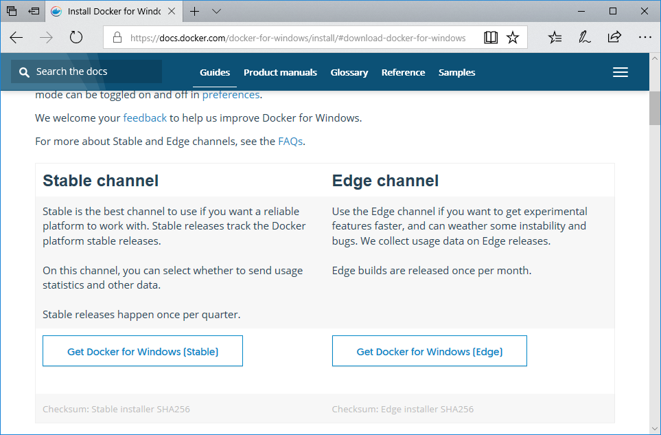
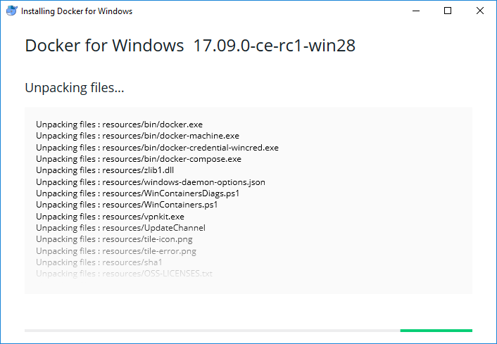
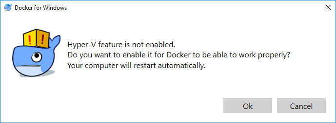
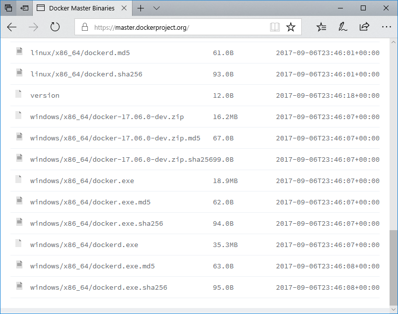
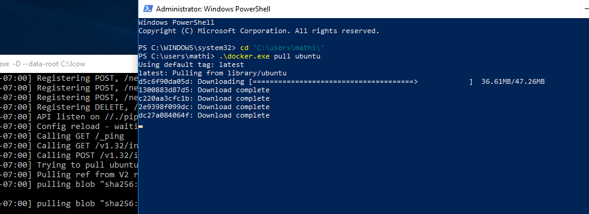

# Running Ubuntu Containers with Hyper-V Isolation on Windows 10 and Windows Server
Duration: 1:00

## Overview

It is now possible to run Docker containers on Windows 10 and Windows Server, leveraging Ubuntu as a hosting base.

Imagine running your own Linux applications on Windows, using a Linux
distribution you are comfortable with: Ubuntu!

It is now possible to do so using the power of Docker technology and Hyper-V virtualization on Windows.


## Requirements
Duration: 5:00

You will need an x86 PC running Windows 10 or Windows Server.

Running Linux containers with Hyper-V is only available when signed up with the [Windows Insider Program][windowsinsider]. This program lets you test pre-release software and upcoming versions of Windows.

If stability and privacy are essential for your installation (Windows Insider allows Microsoft to collect usage information), consider waiting for the [Windows 10 Fall Creator update][win10fall], due October 2017. With this release, running Docker with Hyper-V won't require Windows Insider membership.


You will also need a recent installation of Docker, which can be downloaded from [http://dockerproject.org](http://dockerproject.org).

Finally, you will need to make sure you have installed [XZ Utils](https://tukaani.org/xz/), required for decompressing the Ubuntu host container image.

## Join Windows Insider
Duration: 3:00

If you're already a member of the Windows Insider Program, skip to the next step. If not, open the following link in your favourite web browser:

[https://insider.windows.com/en-us/getting-started/](https://insider.windows.com/en-us/getting-started/)

To enroll, sign in using the same Microsoft personal account you use for Windows 10 and follow the *Register your personal account* link from the Insider Program getting started page. Accept the terms and conditions to complete the registration.

You now need to open Windows 10 *Settings* from the Start menu, select 'Updates & Security' followed by 'Windows Insider Program' from the menu on the left.


If necessary, click on the 'Fix me' button if Windows complains that 'Your Windows Insider Program account needs attention'.

## Windows Insider content
Duration: 1:00

From the Windows Insider Program pane, select 'Get Started'. If your Microsoft account isn't linked to your Windows 10 installation, sign in when prompted and select the account you want to link to your installation.

You will now be able to select what kind of content you'd like to receive from the Windows Insider Program. To ensure availability of the Hyper-V isolation features that Docker requires, select *Fast*. Select *Confirm* (twice), then allow Windows to restart your machine. After booting, it's likely you'll need to wait for your machine to install a variety of updates before you can move on to the next step.
 
 


## Install Docker for Windows
Duration: 2:00

Download Docker for Windows from [Docker Store](https://store.docker.com/editions/community/docker-ce-desktop-windows).
].



Once downloaded, proceed with the installation steps, and reboot your system when indicated.



After reboot, Docker will be started. Docker requires that the Hyper-V feature is enabled, so if necessary will ask you to enable it and restart. Click *OK* for Docker to enable Hyper-V and restart your system.



## Download the Ubuntu container image
Duration: 4:00

Download the latest Ubuntu container image for Windows from the [Canonical Partner Images website](https://partner-images.canonical.com/hyper-v/linux-containers/xenial/current/)

Once downloaded, extract the image using XZ Utils:
```bash
C:\Users\mathi\> .\xz.exe -d xenial-container-hyper-v.vhdx.xz
C:\Users\mathi\>
```

## Prepare the container environment
Duration: 2:00

First, create two directories:


Create *C:\lcow*, which will be used as scratch space for Docker while preparing the containers.


Also create *C:\Program Files\Linux Containers*. This is where the Ubuntu container image will live.

You will need to give this folder extra permissions to allow Docker to use the images from it.  Run the following Powershell script in an administrator Powershell window:

```powershell
param(
[string] $Root
)
# Give the virtual machines group full control
$acl = Get-Acl -Path $Root
$vmGroupRule = new-object System.Security.AccessControl.FileSystemAccessRule("NT VIRTUAL MACHINE\Virtual Machines", "FullControl","ContainerInherit,ObjectInherit", "None", "Allow")
$acl.SetAccessRule($vmGroupRule)
Set-Acl -AclObject $acl -Path $Root
```

Save this file as *set_perms.ps1* and run it:

! Tip - You may need to run 'Set-ExecutionPolicy unrestricted' to be allowed to run unsigned Powershell scripts.


```bash
C:\Users\mathi\> .\ set_perms.ps1 "C:\Program Files\Linux Containers"
C:\Users\mathi\>
```

Now, copy the Ubuntu container image *.vhdx* file that was decompressed at the previous step to *uvm.vhdx* under *C:\Program Files\Linux Containers*.


## More Docker preparation
Duration: 2:00

Docker for Windows requires some pre-release features in order to work with Hyper-V isolation. While these features are not yet available in the Docker CE installation that was done previously, the necessary files can be downloaded from [master-docker](https://master.dockerproject.org).



Retrieve *dockerd.exe* and *docker.exe* from [master-docker](https://master.dockerproject.org), and put the two programs somewhere safe, such as in your own folder. They will be used to start the Ubuntu container in the next step.


## Run an Ubuntu container on Hyper-V
Duration: 3:00




```bash
C:\Users\mathi\> .\ docker.exe pull ubuntu
C:\Users\mathi\> .\ docker.exe run -it ubuntu
```

Congratulations! You have successfully set up your system to use containers with Hyper-V isolation on Windows, and have run your very own Ubuntu container.

## Getting help
Duration: 1:00

If you need some guidance getting started with the Ubuntu container images for Hyper-V, or if you get stuck, help is always at hand:

* [Ask Ubuntu][askubuntu]
* [Ubuntu Forums][forums]
* [IRC-based support][ubuntuirc]

<!-- LINKS -->
[msubuntu]: https://www.microsoft.com/en-us/store/p/ubuntu/9nblggh4msv6
[getstartedcli]: https://help.ubuntu.com/community/UsingTheTerminal
[windowsinsider]: https://insider.windows.com/en-us/
[storelink]: ms-windows-store://pdp/?productid=9NBLGGH4MSV6&referrer=unistoreweb&scenario=click&webig=11a9a85f-44f0-4cf5-ac1f-d9e148f2c23b&muid=01A3F9D8DEC2605B1426F331DF03617B
[win10fall]: https://www.microsoft.com/en-us/windows/upcoming-features
[commdocs]: https://help.ubuntu.com/community/UsingTheTerminal
[askubuntu]: https://askubuntu.com/
[forums]: https://ubuntuforums.org/
[ubuntuirc]: https://wiki.ubuntu.com/IRC/ChannelList
