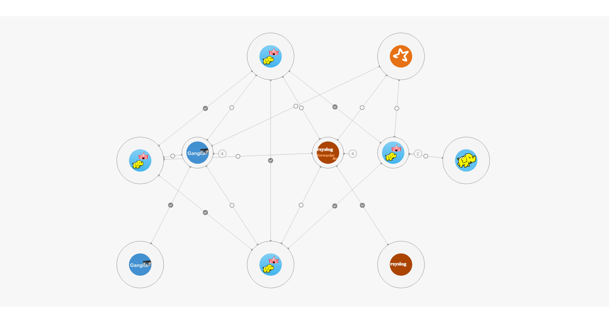
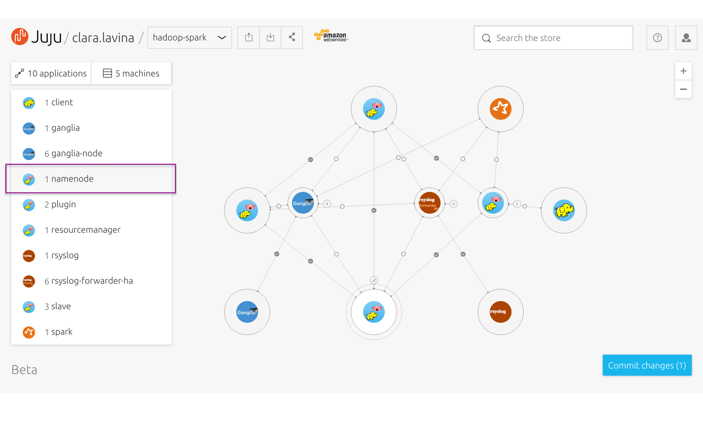
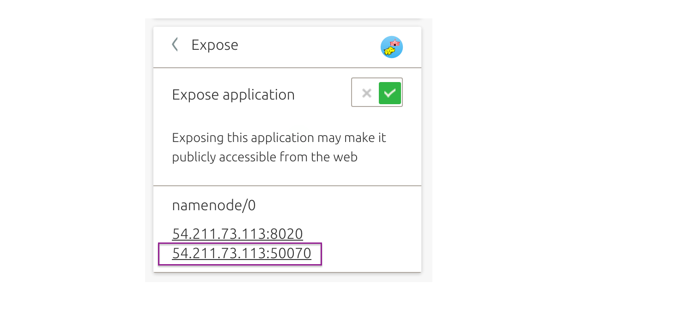
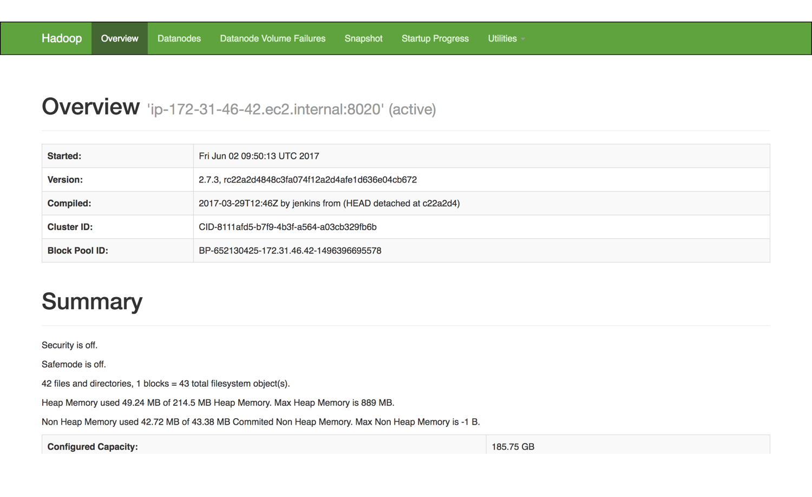
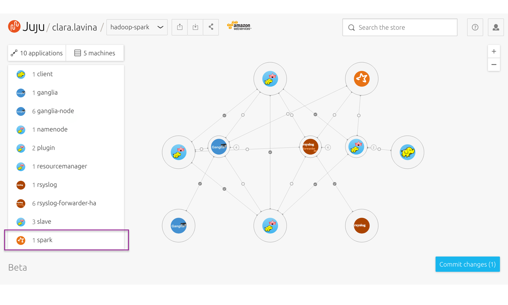
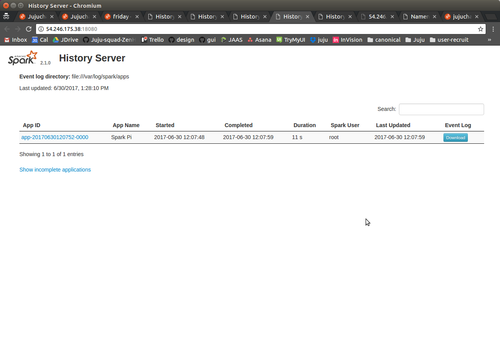
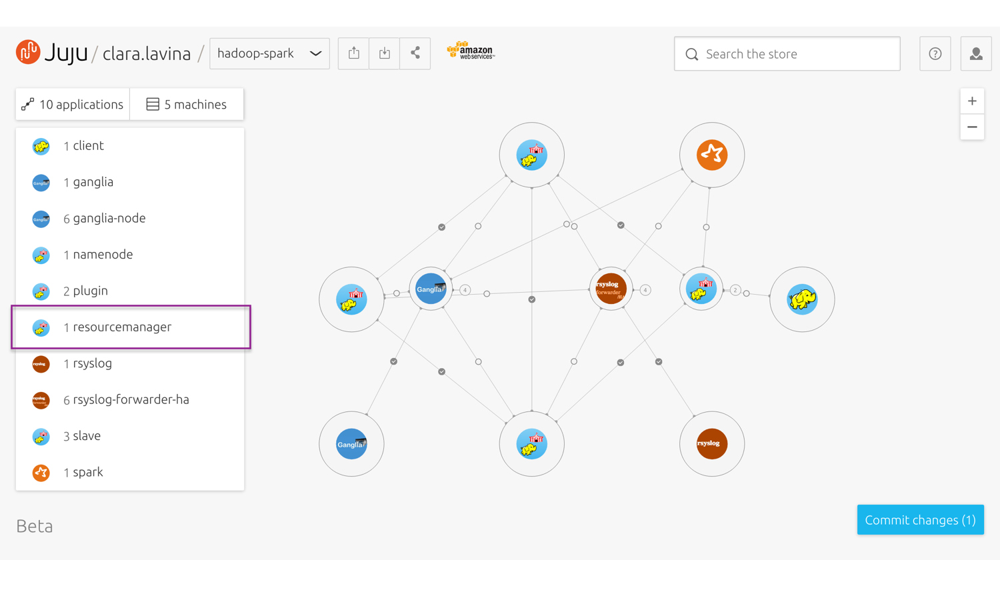
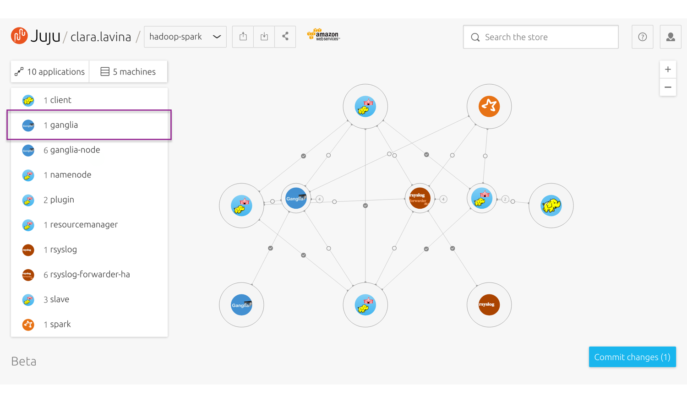
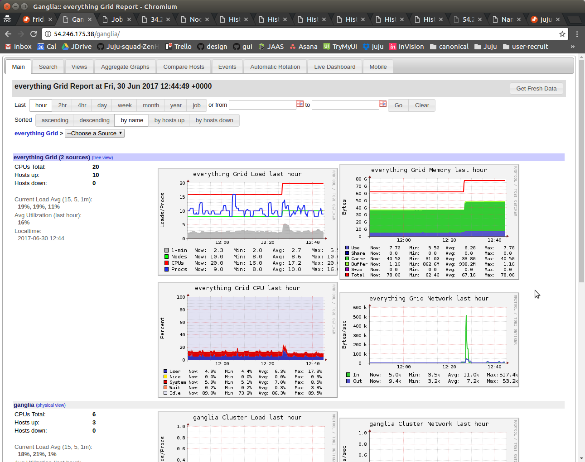

---

id: get-started-hadoop-spark
summary: Learn how to operate a big data cluster, to analyse batch data with MapReduce or streaming data with Spark.
categories: jaas
tags: hadoop, spark, juju, jaas, big data, cloud
difficulty: 2
status: Published
Published: 2017-07-07

---

# Get started with Hadoop Spark

## Overview
Duration: 1:00

### About Hadoop Spark

This provides a highly-available (HA) service on top of a cluster of machines, which is resistant to individual machine failure. It provides a flexible solution consisting of HDFS, MapReduce, and Spark that can process a wide variety of workloads.

Hadoop is designed to scale to thousands of servers, each offering local computation and storage capacity, and is able to detect and handle failures at the application layer.

[Learn more about this bundle](https://jujucharms.com/hadoop-spark/).

### In this tutorial you’ll learn how to...

- Get your Hadoop Spark cluster up and running, using [JAAS](https://jujucharms.com/jaas)
- Operate your new cluster.
- Create your first big data workload.
- Change the execution mode of Spark in your cluster.

### You will need...

* An [Ubuntu One account](https://login.ubuntu.com/) (you can set it up in the deployment process)
* A public SSH key.
* Credentials for AWS, GCE or Azure

## Deploying with JAAS
Duration: 05:00

To kick off, [open Hadoop Spark](https://jujucharms.com/new/?deploy-target=cs:bundle/hadoop-spark) and click the blue Deploy changes (56) button in the bottom right. Then, follow the steps to deploy your bundle.

positive
: Note: We recommend you add your public SSH key (optional). This allows direct access to the machines – which you’ll need to operate your cluster.

Deployment can take up to 30-45 minutes, as Juju creates new instances in the cloud and sets up the Hadoop Spark cluster components. Pending units are outlined in *orange*. Up and running are outlined in *black*.

Congratulations! You now have a Hadoop Spark cluster up and running.

## Install the Juju client
Duration: 5:00

**You will need to have Juju installed locally to operate your cluster. Skip this step if you already have it.**

Juju is available as a client on many platforms and distributions. Visit the [install docs](https://jujucharms.com/docs/stable/reference-install#getting-the-latest-juju) to get the latest version of Juju on **macOS**, **Windows** or **CentOS**.

If you are running **Ubuntu**, you can install Juju through the following steps:

1. It’s helpful to Install Snappy if you don’t have it already.
`$ sudo apt install snapd`

2. Install Juju to get the command line client.
`$ sudo snap install juju --classic`

3. Verify you can run Juju. You will see a summary and a list of common commands.
`$ juju`

You’re all set!

## Connecting to JAAS
Duration: 05:00

1. To connect to JAAS from the command line you'll need to register with the JAAS controller. You will be required to do this just the first time.
`$ juju register jimm.jujucharms.com`

2. This command will open a new window in your default web browser. Use Ubuntu SSO to login and authorise your account.

3. You will then be asked to enter a descriptive name for the JAAS controller.  We suggest using *jaas*.

4. JAAS users with existing models, might first need to switch to the relevant model:
`$ juju switch <model-name>`

5. Your Hadoop Spark cluster is managed as a model by Juju. View the model’s status with:
`$ juju status`

6. To watch continuously, in colour, run:
`$ watch -c juju status --color`

## Running your first Spark workload
Duration: 01:00

 Once your bundle is deployed, in the terminal, run the *sparkpi* demo workload included on the Spark node:

`$ juju run --unit spark/0 /home/ubuntu/sparkpi.sh`

Visit the docs to learn more about how to [monitor, benchmark, and scale](https://github.com/juju-solutions/bigtop/blob/master/bigtop-deploy/juju/hadoop-spark/README.md).

## Spark execution modes
Duration: 3:00

By default, this bundle configures Spark in ‘yarn’ mode. This allows Spark to use the Hadoop cluster for all compute resources.

The Spark execution mode can be changed to use non-Hadoop resources for Spark jobs.  

1. For example, switch Spark into *standalone* mode. In standalone mode, Spark launches a Master and Worker daemon on the Spark unit. This mode is useful for simulating a distributed cluster environment without actually setting up a cluster.
`$ juju config spark spark_execution_mode=standalone`

2. Add 2 additional units to form a 3-node Spark cluster:
`$ juju add-unit -n 2 spark`

in the inspector, click on the application "spark" and then "pending" to see details of the machines being provisioned and the charm software installed and initialised.

For more details on the Spark execution modes, visit the [configuration section of the Spark charm](https://github.com/apache/bigtop/tree/master/bigtop-packages/src/charm/spark/layer-spark#spark_execution_mode).

## Access the dashboards
Duration: 10:00

### Namenode dashboard

Back in the Juju GUI, in your web browser, click on individual charms and expose these endpoints to operate your cluster.

1. In the GUI, select the **Namenode charm**.

2. Select *Expose* in the inspector on the left hand side and set the toggle *ON*,  so you can connect to this unit. If the deployment isn’t yet completed, no public address will be available.

3. Click *Commit changes*.

4. Once deployment is complete, you can visit an **overview of the Hadoop cluster** with your web browser. Click the link public IP number and port (e.g. *xxx.xxx.xxx.xxx:50070*). It will open in a new browser tab.

### Spark

1. In the GUI, select **Spark**.

2. Select *Expose* in the inspector on the left hand side and set the toggle *ON*,  so you can connect to this unit.

3. Click *Commit changes*

4. Once deployment is complete, you can open the *link xxx.xxx.xxx.xxx:18080* for *spark/0* to view the Spark Job History interface, showing details of you completed jobs -- including the Pi calculation you ran earlier.

Learn more about [monitoring Spark.](https://spark.apache.org/docs/latest/monitoring.html)

### Resource manager

1. In the GUI, select **Resource Manager** charm.

2. *Expose* the charm.

3. Click *Commit changes*

4. Once it’s ready, click the *first link* (e.g. *xxx.xxx.xxx.xxx:8088*) to open the **YARN cluster dashboard**, which includes information about the Hadoop compute nodes in your cluster.

The *second link* (e.g. *xxx.xxx.xxx.xxx:19888*) opens the **YARN History Server**, which includes information about Hadoop or Spark jobs submitted to your cluster.

### Ganglia

1. Select *Ganglia* (not Ganglia-node).

2. *Expose* the charm.

3. Click *Commit changes*

4. Visit *xxx.xxx.xxx.xxx:80/ganglia* to open the **Ganglia web interface**, a visual dashboard of load and performance charts for your cluster.

**Note**:  *You will need to append “/ganglia” to the URL to reach the Ganglia interface.*

## That’s all folks!

### Further reading

* Learn more about the [Hadoop Spark bundle](https://jujucharms.com/hadoop-spark/).
* Discover other [Big Data solutions ](https://jujucharms.com/big-data).
* Get involved and connect with the [Juju Big Data community](http://bigdata.juju.solutions/getstarted?mkt_tok=eyJpIjoiWVdGbFpUSmtaamd4TVRZMyIsInQiOiJZREphTkJraGl4c0JObHR0dGY0UWtQd20wNVwva3VqaWp4VWNaQTRucTZsNlRSYmZhU3NQXC9Ib0NvR3VrZ2VQdFE2V2I2YlBMSmxHamhZNmFSY01GR1J3PT0ifQ%3D%3D).
