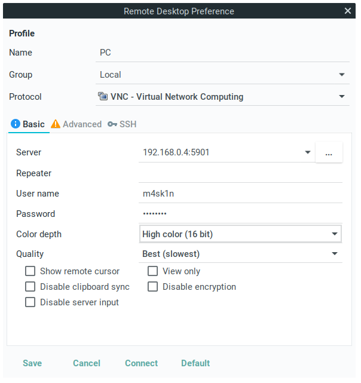
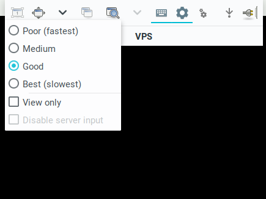

# Access a remote desktop

## Overview
Duration: 1:00

**Virtual Network Computing** (VNC) is a protocol commonly used to share graphical desktop over a network. Popular uses for VNC include technical support.

By default, Ubuntu comes with [Remmina] remote desktop client with support for VNC and RDP protocols. We will use it to accessremote server.

### What you’ll need

  - A computer running Ubuntu 16.04 LTS or above
  - A configured VNC connection
  - Remmina Remote Desktop Client installed

positive
: If you don’t have Remmina on your Ubuntu installation, install it with `sudo apt install remmina remmina remmina-plugin-vnc`. You can also use snap package (`sudo snap install remmina`).

## Remmina interface
Duration: 1:00

Remmina comes with easy-to-use interface, allowing us to save remote desktop preferences. We can add profiles to groups, to make searching them easier.

## Adding connection
Duration: 3:00

Although you can quickly connect with VNC by switching from ***RDP*** to ***VNC*** in drop-down menu in main window, typing your IP address (with port, of course) and clicking ***Connect !*** button, it’s better to create save connection to make next connections faster.

Run Remmina. Click on ***New***. You can set name and add connection to one of groups (it can be anything you want) and select***VNC - Virtual Network Computing*** from protocols drop-down menu.

In ***Server*** field, type IP address of server you are going to connect with, including port. Type VNC password (can differ from user apssword) in ***Password*** field. That’s everything you will usually need to do.

Because of limitations caused by speed of Internet connections and lack of possibility for hardware acceleration, by default ***Color depth*** is set to 8-bit (8 bpp). You can change it to 16-bit or 24-bit, if you need. You can also change graphics quality, which will also affect on Internet speed.

Now, let's connect to our VNC!

## Connecting with VNC server.
Duration: 3:00

To connect with configured VNC server, simply double-click on newly created profile.

In toolbar, you have options to switch to fullscreen mode, change view and graphics quality. 

## That's all!
Duration: 1:00

### Easy, wasn't it?

Congratulations! You have just learned how to use Remmina to connect with VNC server. You can remotely access your computer or give someone technical support (if he know how to configure VNC server…).

If you need more guidance on using VNC client, help is always at hand:

* [Ask Ubuntu][askubuntu]
* [Ubuntu Forums][forums]
* [IRC-based support][ubuntuirc]

### Further readings
  - [Remmina Wiki page][remmina-wiki]

<!-- LINKS -->
[Remmina]: https://www.remmina.org/
[askubuntu]: https://askubuntu.com/
[forums]: https://ubuntuforums.org/
[ubuntuirc]: https://wiki.ubuntu.com/IRC/ChannelList
[remmina-wiki]: https://github.com/FreeRDP/Remmina/wiki

