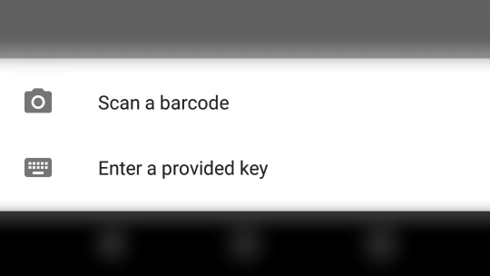
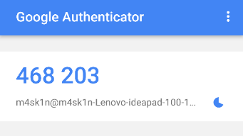

# Configure SSH to use two factor authentication
Duration: 1:00

## Overview

SSH, the secure shell, is often used to access remote Linux systems. Because we often use it to connect with computer containing important data, it's recommended to add another security layer. Here comes the two factor authentication (*2FA*).

### Requirements

All you need is a PC running Ubuntu and configured SSH connection.

  - You should understand the danger of stolen passwords.
  - You don't need to know what two factor authentication is and how it works.


## What is two factor authentication
Duration: 1:00

Multi factor authentication is a method of confirming your identity using at least two different was of authentication. The most common and easiest to implement example of two factor authentication uses combination of **passphrase** (often called *password*, which implies that you should just use single word to log in) and one-time-passcode generated by special mobile app.

We will use Google Authenticator app available for Android (in [Play Store]) and iOS (in [iTunes]) to generate authentication codes.


## Installing and configuring required packages
Duration: 3:00

### Installing required package

Start a terminal session and type:

```bash
$ sudo apt install libpam-google-authenticator
```


### Configuring SSH

To make SSH using the oath PAM module, add following to the /etc/pam.d/sshd file:

```
auth required pam_google_authenticator.so
```

Now you need to restart `sshd` daemon using:

```bash
$ sudo systemctl restart sshd.service
```

Modify `/etc/ssh/sshd_config` – change `ChallengeResponseAuthentication` from `no` to `yes`:

```
# Change to yes to enable challenge-response passwords (beware issues with
# some PAM modules and threads)
ChallengeResponseAuthentication no # CHANGE THIS TO YES

# Change to no to disable tunnelled clear text passwords
#PasswordAuthentication yes
```


## Configuring authentication
Duration: 2:00

Google Authenticator makes configuration of two factor authentication much easier, comparing to (for example) libpam-oath.

Use `google-authenticator` command. It will ask you a few questions. I recommend to make tokens time-based, update `.google_authenticator` file, disallow multiple uses, the next one depends of you (I increased it, but most people won't need it) and enable rate-limiting.

Write down your emergency codes on paper or find other, safe place to keep them. You will need it if you won't have access to your phone.

That's all. Now, let's open Google Authenticator and add our secret code to make it work.


negative
: We shouldn't use unencrypted services to store secret key, so don't place it in your notes synchronization service and so on. If you don't want to type the key manually, use QR code.

## Adding secret to Google Authenticator
Duration: 2:00

We will use latest version of Authenticator from Play Store. The progress shouldn't look very different on iOS.


### Add secret through QR code

Touch the Add icon (+) and select “Scan a barcode”. Use phone camera to scan QR code. You can use this key to access SSH.



### Add secret through key

Touch the Add icon (+) and select “Enter a provided key”. Enter the name that will make you remember it's authentication key for your SSH shell. Type key provided by `google-authenticator` command.




## Getting help
Duration: 1:00

Congratulations! You have just configured two factor authentication for SSH shell using Google Authenticator. Now, every time you (or some bad guy with your password…) will try to log in to your SSH shell, you (or this bad guy) will be asked for authentication key in addition to traditional passphrase.

If you need some guidance on using two factor authentication, help is always at hand:

* [Ask Ubuntu][askubuntu]
* [Ubuntu Forums][forums]
* [IRC-based support][ubuntuirc]

<!-- LINKS -->
[Play Store]: https://play.google.com/store/apps/details?id=com.google.android.apps.authenticator2
[iTunes]: https://itunes.apple.com/us/app/google-authenticator/id388497605
[askubuntu]: https://askubuntu.com/
[forums]: https://ubuntuforums.org/
[ubuntuirc]: https://wiki.ubuntu.com/IRC/ChannelList

