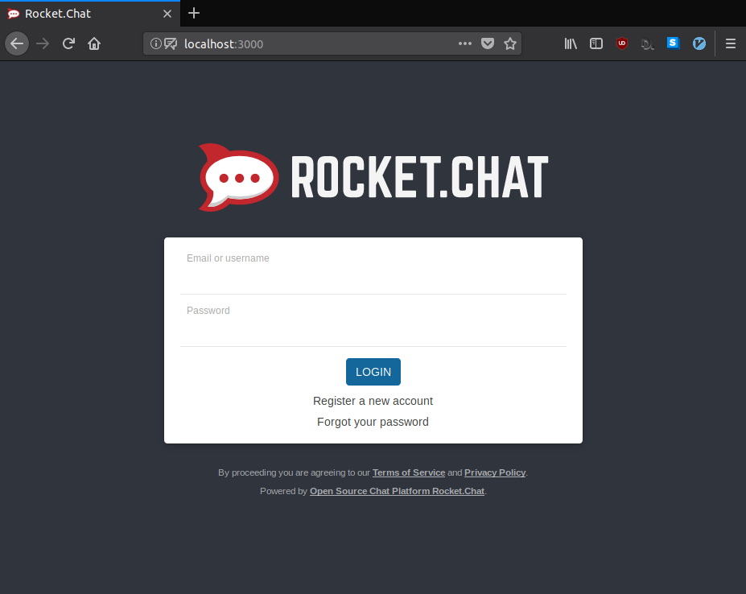
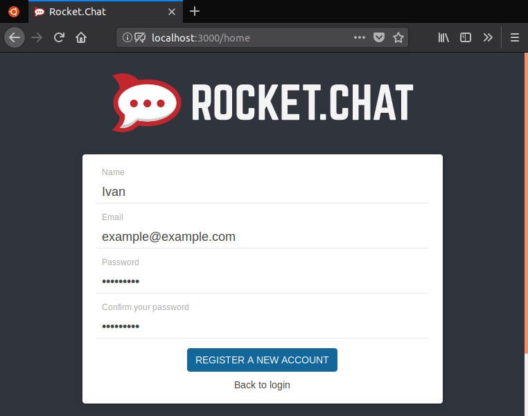
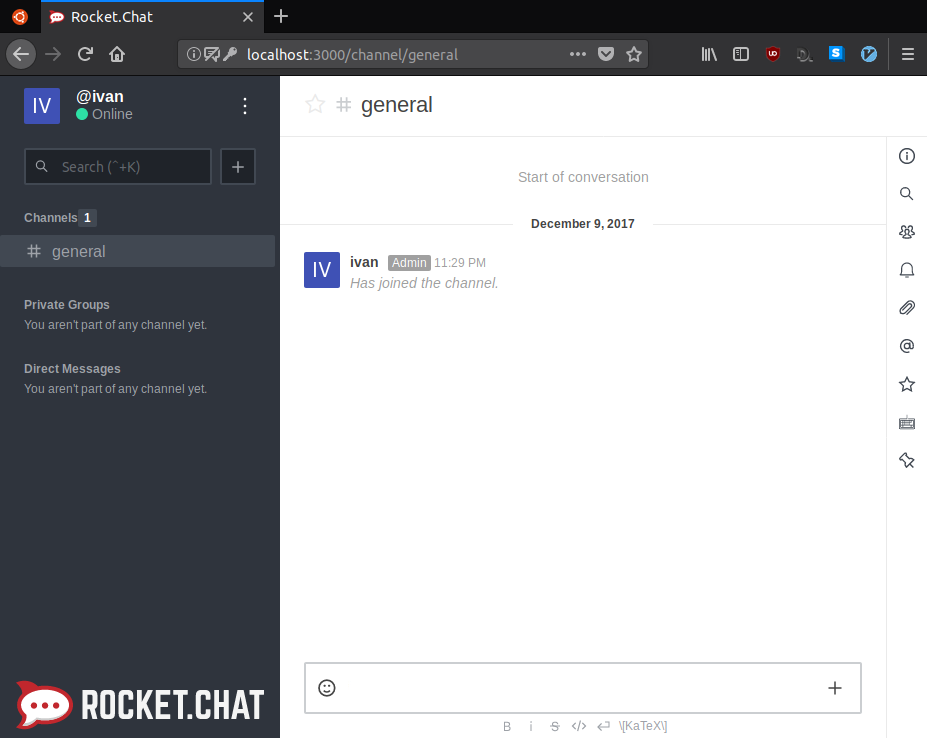
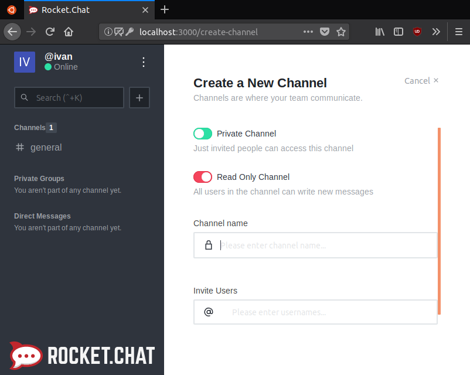

---
id: setup-rocketchat-server-on-ubuntu
summary: Learn how to setup a RocketChat server on Ubuntu.
categories: server
tags: guide, rocketchat, server
difficulty: 2
status: published
feedback_url: https://github.com/canonical-websites/tutorials.ubuntu.com/issues
author: Ivan Fonseca <ivanfon@riseup.net>
published: 2017-12-09

# Setting up a RocketChat Server on Ubuntu

## Overview
Duration: 1:00

RocketChat is an open-source team chat client, similar to other team chat solutions such as Slack and Mattermost. It can be self-hosted, supports voice & video chat, and has apps for all popular platforms (web, Windows, macOS, Linux, Android and iOS).

### What you'll learn

This tutorial will teach you how to setup and configure a RocketChat server on Ubuntu.

### What you'll need

- Ubuntu Desktop or Server 16.04 or greater
- Basic command-line knowledge

positive
: **If you want to install Ubuntu Server, follow [this tutorial](https://tutorials.ubuntu.com/tutorial/tutorial-install-ubuntu-server)**

Survey
: How will you use this tutorial?
 - Only read through it
 - Read it and complete the exercises
: What is your current level of experience with RocketChat?
 - Novice
 - Intermediate
 - Proficient

## Installation
Duration: 2:00

First, we need to install RocketChat. RocketChat can easily be installed using Snapcraft. Snaps are secure, isolated from the rest of your system, and auto-updated.

### Installing the Snap

Thanks to Snapcraft, the installation is extremely simple. Install the Snap with the following command:

```bash
snap install rocketchat-server
```

### Accessing your server

By default, your server will be available on port 3000. You can access this by going to `serverIP:3000` in your web browser, or `localhost:3000` if you're running the server locally. You should be greeted by the following screen:



Now that your server is setup, you can actually start using it! In the next sections, we'll cover basic usage and configuration of your server.

## Basic usage
Duration: 5:00

positive
: **You should already have the RocketChat server installed!**
To install it, run `snap install rocketchat-server`. You can access the server at `localhost:3000`.

### Creating an account

First, you'll have to create an account. The first account created on the server will be an admin, which will allow you to configure the server.

Click on `Register a new account`. You'll be shown a screen where you must enter your name, email and password.

negative
: **The `Name` field on this page is not your username!**
Your username will be chosen on the next page. The `Name` field on this page should be your actual name, so your team members can identify you.



After registering, you will be logged in automatically. By default there will be one channel (`#general`), and there should be a message showing that you joined. There should be badge beside your name, indicating that you're an admin, as shown below:



### Channels

In the left sidebar, there is a list of channels. You can switch to a channel by clicking on it. A channel is essentially a seperate chat room made for a specific topic with different sets of people.

#### Creating a channel

A channel may be created by clicking on the plus sign beside the search bar. Channels may be private and require an invite, or public for anyone in your team to join. Channel names may only include lowercase letters, numbers and dashes.



#### Sending direct messages

You may send direct messages to team members by opening the member list (located on the right sidebar), clicking on someone's name and clicking on the `Conversation` button. Past direct messages will appear on the left sidebar, under the list of channels.

#### Messages

Messages can be sent (quite intutively) by typing in the chatbar and pressing enter. You may add attachments (files, video and audio), emoji and apply basic formatting.

All messages have a menu that can be accessed by hovering over them and clicking on the series of dots that appear over it at the top-right corner. If you sent the message (or you have the proper permissions), you can edit or delete the message. You can also star a message to save it for later, or, with the proper permissions, pin it to the channel to save it for everyone. Stars and pins can be accessed from the right sidebar.

#### Other features

From the right sidebar, you can also change notification prefernces and see the file list for a channel. If you click on your name at the top-left, you will open a menu where you can change your status (online, away, etc), change your account settings, or (if you're an admin) change server administration settings.

That's a quick RocketChat primer. Now, let's move on to server configuration!

## Managing the RocketChat service
Duration: 3:00

Your RocketChat server is managed through systemd services. They start on boot by default and automatically restart on failure.

You can check the status of the RocketChat server service with the following command:

`systemctl status snap.rocketchat-server.rocketchat-server.service`

The output will look something like:

```
snap.rocketchat-server.rocketchat-server.service - Service for snap application rocketchat-server.rocketchat-server
   Loaded: loaded (/etc/systemd/system/snap.rocketchat-server.rocketchat-server.service; enabled; vendor preset: enabled)
   Active: active (running) since Sat 2017-12-09 23:36:30 EST; 1h 13min ago
...
```

The `Active` line tells us that the service is running. Say we want to stop the service:

`systemctl stop snap.rocketchat-server.rocketchat-server.service`

Now our server will be inaccesible, and if we check it's status:

```
snap.rocketchat-server.rocketchat-server.service - Service for snap application rocketcha
   Loaded: loaded (/etc/systemd/system/snap.rocketchat-server.rocketchat-server.service; en
   Active: inactive (dead) since Sun 2017-12-10 00:54:25 EST; 1min 15s ago
...
```

As you can see, the `Active` line now says `inactive`.

To start the server again, we can run the above command, replacing `stop` with `start`:

`systemctl start snap.rocketchat-server.rocketchat-server.service`

We can also restart the server directly, instead of starting and stopping it:

`systemctl restart snap.rocketchat-server.rocketchat-server.service`

The MongoDB database that powers your RocketChat server is ran by the `snap.rocketchat-server.rocketchat-mongo.service` service. You can use the same `systemctl` commands above to manage it.

## Changing port and enabling SSL
Duration: 3:00

RocketChat uses Caddy as it's HTTP server. We can generate a default config with:

`rocketchat-server.initcaddy`

The output will be similar to the following:

```
Replace /var/snap/rocketchat-server/1195/Caddyfile with your own to customize reverse proxy
```

Edit the file with your favourite editor (such as Vim or Nano). It should look like the following:

```
http://:8080
proxy / localhost:3000 {
  websocket
  transparent
}
```

If you want to change the port or enable SSL, change the first line to your domain name. For example, if our domain is `example.com`, we would change the file to:

```
example.com
proxy / localhost:3000 {
  websocket
  transparent
}
```

You can also change the port. For example, to use the port `3001`, we change the first line of our config file to `example.com:3001`.

positive
: **If you're running the server locally, you can replace the domain with `localhost`.**
In the example above, we would change the first line to `localhost:3001`.

By leaving the `http` or `https` out of the domain, HTTP will automatically be redirected to HTTPS.

negative
: **When you change the domain or port, you must also change the `Site URL` setting in RocketChat.**
The next time an admin logs in, RocketChat will prompt them to automatically change the `Site URL`. You can also change this in the server administration settings.

### Further reading

For more info about configuring SSL, refer to the [RocketChat documentation](https://rocket.chat/docs/installation/manual-installation/ubuntu/snaps/autossl/).

## Conclusion

Congratulations, you now have a RocketChat server ready to go for your team! RocketChat has a lot of features, and this was just a brief introduction. If you want to learn more about general usage, server administration or contributing to RocketChat, check out the [RocketChat documentation](https://rocket.chat/docs).

