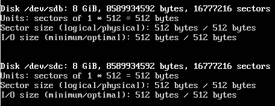
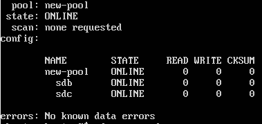

# Setup ZFS Storage Pool

## Overview
Duration: 1:00

A ZFS storage pool can be comprised of multiple hard drives. When storage space in a pool is running low, we can simply add extra drives to expand it.

This guide will go through the process of installing ZFS and setting up a storage pool.

### What you'll learn
- How to install ZFS
- How to create a storage pool

### What you'll need
- Ubuntu Server 16.04 LTS

Ready? Let's head over to the next step!

## Installing ZFS
Duration: 1:00

To install ZFS, run:
```bash
sudo apt install zfsutils-linux
```

After that, we can check if ZFS was installed correctly by running:
```bash
whereis zfs
```

The following should be its output:


Now that we're done installing the required packages, let's create a storage pool!

## Creating a ZFS Pool
Duration: 2:00

### Choosing Drives to Pool

Check installed drives by running:
```bash
sudo fdisk -l
```
Note down the device letter of drives you want to pool.

These are the two drives we're going to pool:


### Creating a Pool

There are two types of storage pools we can create. A `striped pool`, where a copy of data is stored across all drives or a `mirrored pool`, where a single complete copy of data is stored on all drives.

To create a striped pool, we run:
```bash
sudo zpool create new-pool /dev/sdb /dev/sdc
```

To create a mirrored pool, we run:
```bash
sudo zpool create new-pool mirror /dev/sdb /dev/sdc
```
In both commands, `new-pool` is the name of the pool.

negative
: **Sometimes an error like this might pop up:**

Add "`-f`" to the end of the `zpool create` command to override it.

A `mirrored pool` is usually recommended as we'd still be able to access our data if a single drive fails. However, this means that we'll only get the capacity of a single drive. A `striped pool`, while giving us the combined storage of all drives, is rarely recommended as we'll lose all our data if a drive fails.

The newly created pool is mounted at `/new-pool`.

To go into the directory of our newly created pool, run:
```bash
cd /new-pool
```

## Checking Pool Status
Duration: 1:00

Check the status of ZFS pools with:
```bash
sudo zpool status
```
This is the status of our newly created pool:



### Find out more about ZFS Storage Pools...
- [Oracle ZFS Administration Guide](https://docs.oracle.com/cd/E19253-01/819-5461/index.html)
