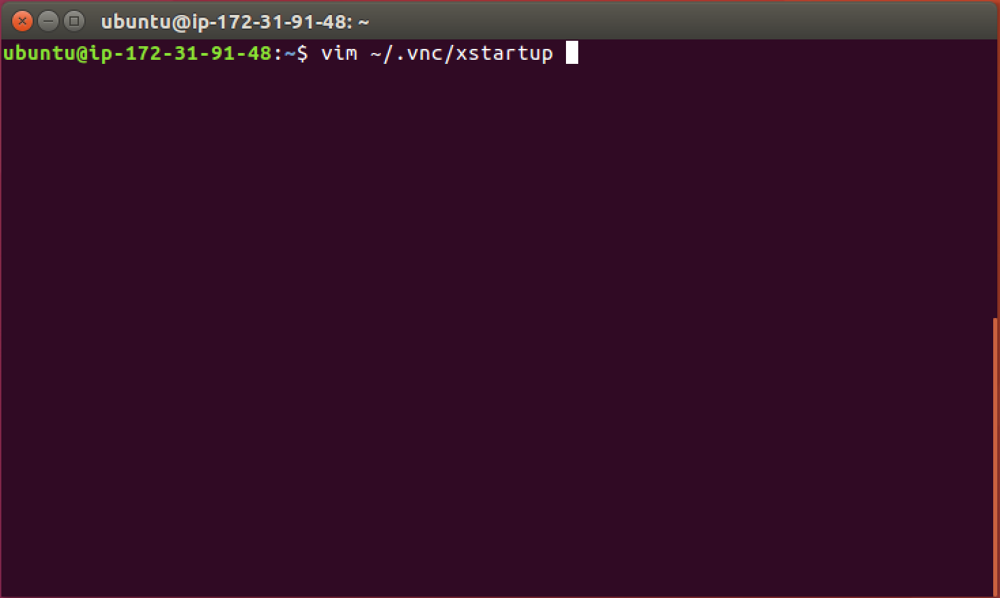
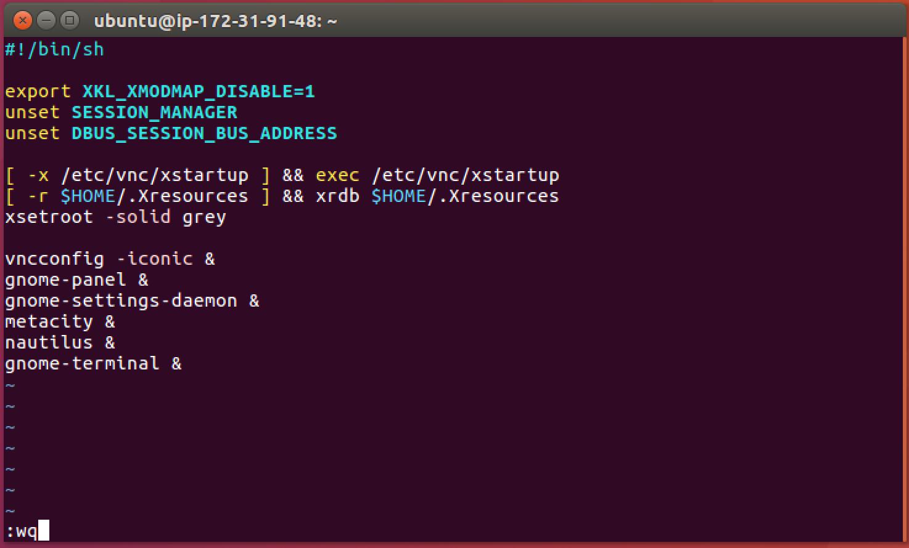
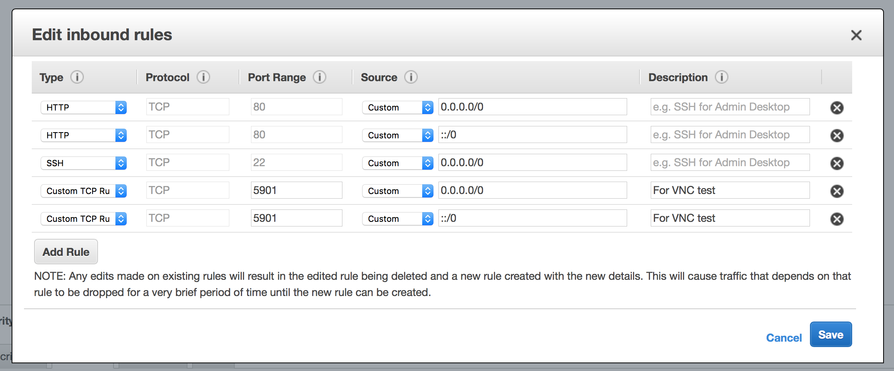
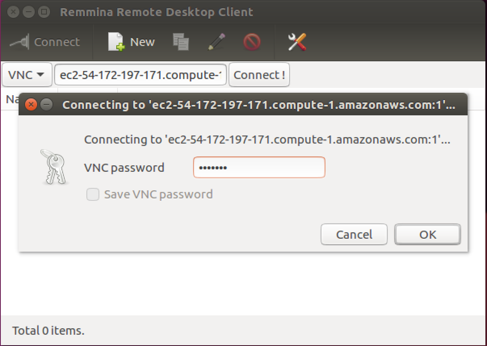
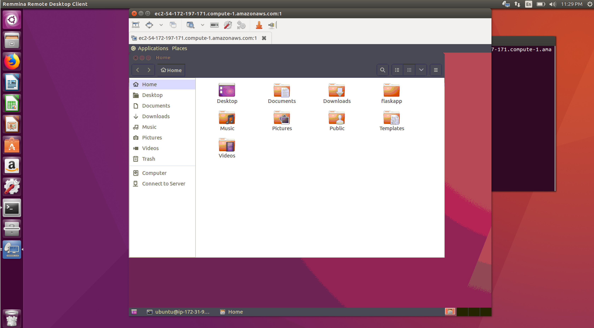

# Running Ubuntu Desktop on an AWS EC2 instance

## Overview
Duration: 0:01

This tutorial will guide you through the setup of running ubuntu desktop on AWS EC2 Instance using TightVNC on a
system running Ubuntu 16.04+.

What you'll need :

* Access to an AWS EC2 instance using commandline - This tutorial assumes that you're logged into the machine using SSH
* A machine running ubuntu 16.04+
* Remmia Remote Desktop Client (Pre-installed on 16.04+)

## Setting up TightVNC on AWS
Duration: 0:02

Let's install Ubuntu Desktop and TightVNC on your EC2 instance.
After logging in to your EC2 instance using the terminal, enter the following commands to install the tools that will be required to run Ubuntu desktop :

: Note: While installing VNC Server you'll be required to setup a password for the server.
So remember this since it will be needed later to connect to our VNC server.

```bash
 sudo apt-get update

 sudo apt-get install ubuntu-desktop

 sudo apt-get install tightvncserver

 sudo apt-get install gnome-panel gnome-settings-daemon metacity nautilus gnome-terminal
```

After completion, your machine is ready with GUI support but needs some configuration to be done.

## Configuring the VNC server
Duration: 0:05

In your terminal type the following command to launch VNC server to create an initial configuration file:

```bash
 vncserver :1
```

Open the configuration file in vim:

```bash
 vim ~/.vnc/xstartup
```



Press the 'i' key on your keyboard to get into the insert mode which will allow you to enter text into the file.
Edit the file to look like so :

```bash
#!/bin/sh

export XKL_XMODMAP_DISABLE=1
unset SESSION_MANAGER
unset DBUS_SESSION_BUS_ADDRESS

[ -x /etc/vnc/xstartup ] && exec /etc/vnc/xstartup
[ -r $HOME/.Xresources ] && xrdb $HOME/.Xresources
xsetroot -solid grey

vncconfig -iconic &
gnome-panel &
gnome-settings-daemon &
metacity &
nautilus &
gnome-terminal &

```

After you’re done, enter '*Ctrl + :*' and type '*wq*' to save and quit the file.



Great! 
We're almost done with the configuration.
Now, let's restart the VNC server by killing it first and then starting it up.

To kill the vnc server and start it again, type the following command:
```bash
$ vncserver -kill :1

$ vncserver :1
```

Congratulations, you're done with the configuration for Ubuntu Desktop.

## AWS Configuration 
Duration: 0:02

We need to make sure that the AWS instance has inbound rules setup to allow connection using VNC.
So, head over to your AWS EC2 console and modify the inbound-rules.
Add the entry : 
Custom TCP Rule | TCP | 5901 | Custom | 0.0.0.0/0 | VNC Connect 

 

Save this entry.
Done! 

## Connecting to Ubuntu Desktop 
Duration: 0:02

Launch Remmina Remote Desktop Client.
Then, 
1. Choose the connection type as 'VNC'

2. Enter your EC2 url along with the port number as 1.
For eg. : 
My EC2 instance URL and the port number as 1 will be  
```bash
 ec2-54-172-197-171.compute-1.amazonaws.com:1
```

3. Enter the password you provided during the installation of the VNC Server.
4. Connect! 

Congratulations, you've successfully configured your EC2 instance to run Ubuntu Desktop GUI Support.



Hope you liked the tutorial.

## Finding help
Duration: 0:02

The Ubuntu community, for both desktop and server, is one of the friendliest and most well populated you can find. That means if you get stuck, someone has most likely already been there and solved the same problem.

Try asking for help in one of the following:

* [Ask Ubuntu](https://askubuntu.com/)
* [Ubuntu Forums](https://ubuntuforums.org/)
* [IRC-based support](https://wiki.ubuntu.com/IRC/ChannelList)

Alternatively, if you need commercial support for your server deployments, take a look at [Ubuntu Advantage](https://www.ubuntu.com/support).
