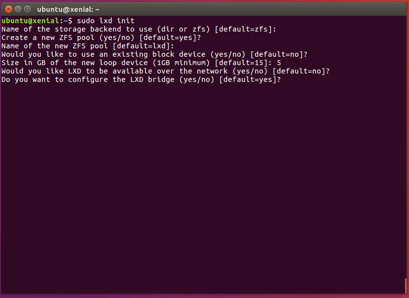
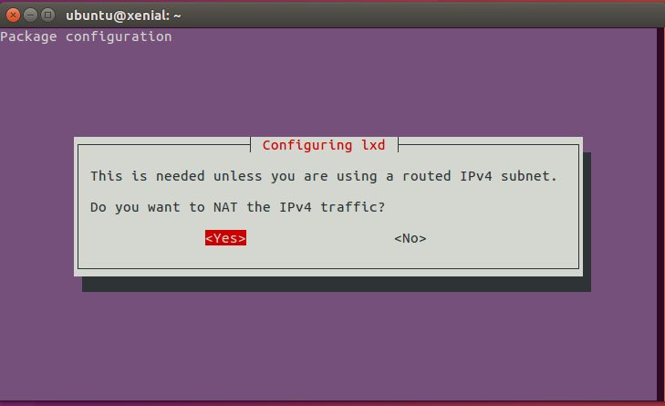
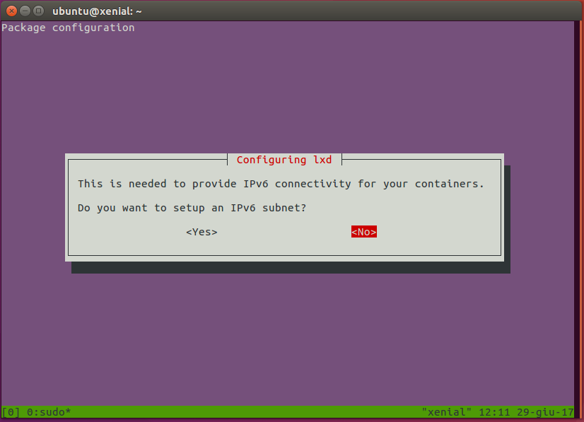

# Configuration de LXD sur Ubuntu 16.04

## Aperçu
Durée: 0:01

[LXD](https://linuxcontainers.org/lxd) est un hyperviseur de conteneur 
fournissant une API ReST pour gérer les conteneurs LXC.


Il permet d'utiliser des conteneurs et de gérer des ressources connexes,
comme les volumes de stockage et les réseaux.

Ce tutoriel montrera comment installer et configurer LXD sur Ubuntu 
16.04 (Xenial Xerus), et comment lancer un conteneur et y accéder.

### Pré-requis

Le didacticiel nécessite une installation d'Ubuntu 16.04 (version de 
Bureau ou Serveur), avec un accès à Internet. Cela peut être soit une 
machine physique ou une machine virtuelle. 

## Installer LXD
Durée: 0:04

Si vous utilisez une installation d'Ubuntu Server 16.04, LXD est déjà 
installé sur votre système.

Sur les installations bureautiques, il doit être installé manuellement. 
Ouvrez un terminal et exécutez les commandes suivantes pour installer 
LXD :

```bash
sudo apt update
```

suivi de :

```bash
sudo apt install lxd
```

### Ajouter votre utilisateur au groupe LXD

Pour permettre à votre utilisateur d'accéder localement au démon LXD, 
il doit faire partie du groupe `lxd`.

Pour ce faire, exécutez :

```bash
sudo adduser <USER> lxd
```

où `<USER>` est votre nom d'utilisateur.

Le nouveau groupe sera effectif à la prochaine session de connexion,
pour l'appliquer au shell actuel, exécutez :

```bash
newgrp lxd
```


### Installer les outils ZFS

Pour ce tutoriel, nous configurerons LXD en utilisant le back-end de 
stockage **ZFS**.

Le système de fichiers ZFS fournit une fonctionnalité de 
copie-sur-écriture et permet d'utiliser des fonctionnalités avancée de 
LXD, comme les quotas de disques par conteneur, les snapshots et 
restaurations instantané, la migration optimisée (envoi/réception) et la
création instantanée de conteneurs à partir d'une image.

Pour installer les outils ZFS, exécutez simplement :

```bash
sudo apt install zfsutils-linux
```

## Paramétrage de LXD
Durée: 0:04

Nous pouvons maintenant procéder au paramétrage du démon LXD.

Pour le faire, exécutez :

```bash
sudo lxd init
```

qui pose une série de questions sur la façon de configurer le démon.

Nous pouvons simplement sélectionner la réponse par défaut (en appuyant 
sur Entrée) pour la plupart d'entre elles. Vous pouvez choisir la taille
du périphérique de boucle pour le pool ZFS en fonction de votre espace 
disque disponible.



Dans le cadre de la configuration d'initialisation de LXD, le réseau 
peut également être configuré, de sorte que les conteneurs engendrés 
puissent être consultés depuis l'hôte.

Alors, choisissons **Yes** à la première question, afin de créer un pont
réseau :


Acceptez le nom par défaut pour le pont `lxdbr0`:


Configurez la mise en réseau IPv4 pour le pont en sélectionnant 
**Yes** :


The configurator will ask for a few details on how to configure the IPv4
network, specifically:
Le configurateur vous demandera quelques détails sur la configuration
du réseau IPv4, en particulier:

 * l'adresse
 * CIDR
 * la plage d'adresse pour le DHCP
 * nombre maximum de clients DHCP

Nous pouvons accepter les réponses par défaut pour ces questions 
également.

Finallement, répondre **Yes** à la question à propos du NAT sur le 
réseau :



Une configuration similaire est disponible pour les réseaux IPv6, mais 
nous pouvons l'ignorer et choisir de ne pas configurer IPv6.



C'est fini ! LXD est maintenant configuré et prêt à être utilisé.

## Lancer un conteneur
Durée: 0:02

Il est maintenant temps de commencer à utiliser LXD.

Tout d'abord, veillons à ce que le client puisse se connecter au démon, en exécutant :

```bash
lxc list
```

La sortie devrait être similaire à :

```bash
Generating a client certificate. This may take a minute...
If this is your first time using LXD, you should also run: sudo lxd init
To start your first container, try: lxc launch ubuntu:16.04

+------+-------+------+------+------+-----------+
| NAME | STATE | IPV4 | IPV6 | TYPE | SNAPSHOTS |
+------+-------+------+------+------+-----------+
```

qui montre qu'il n'y a pas de conteneur en cours d'exécution.which shows there are no running containers.

Lançons maintenant notre premier conteneur :

```bash
lxc launch ubuntu:16.04
```

La sortie devrait ressembler à ceci :

```bash
Creating stirring-beagle
Starting stirring-beagle
```

Cela va télécharger l'image officielle Ubuntu 16.04 LTS (Xenial Xerus) 
et lancer un conteneur depuis avec.

Si un nom de conteneur n'est pas fourni (comme dans ce cas), un nom 
aléatoire sera généré.

Vérifions que notre conteneur est effectivement en cours d'exécution 
avec `lxc list` :

```bash
+-----------------+---------+-----------------------+------+------------+-----------+
|      NAME       |  STATE  |         IPV4          | IPV6 |    TYPE    | SNAPSHOTS |
+-----------------+---------+-----------------------+------+------------+-----------+
| stirring-beagle | RUNNING | 10.147.177.171 (eth0) |      | PERSISTENT | 0         |
+-----------------+---------+-----------------------+------+------------+-----------+
```

Nous pouvons exécuter des commandes dans le conteneur en utilisant 
`lxc exec` :

```bash
lxc exec stirring-beagle -- ls -la
```

ce qui exécutera la commande fournie en tant que `root` sur le conteneur
ciblé :

```bash
total 7
drwx------  3 root root    5 Jun 29 11:29 .
drwxr-xr-x 22 root root   22 Jun 19 23:52 ..
-rw-r--r--  1 root root 3106 Oct 22  2015 .bashrc
-rw-r--r--  1 root root  148 Aug 17  2015 .profile
drwx------  2 root root    3 Jun 29 11:29 .ssh
```

L'accès au shell du conteneur peut être obtenu avec `lxc exec 
stir-beagle /bin/bash`

Notez que, puisque nous avons également configuré le réseau, le 
conteneur a une adresse IPv4 (comme indiqué par `lxc list`) et peut 
également être atteint via ssh depuis l'hôte. 
Ceci, cependant, nécessite d'importer une clé ssh dans le conteneur 
d'abord.

Une fois que le conteneur n'est plus nécessaire, il peut être arrêté :

```bash
lxc stop stirring-beagle
```

et détruit :

```bash
lxc delete stirring-beagle
```


## C'est tout !

Votre machine est maintenant configurée pour exécuter des conteneurs
LXD.

LXD fournit beaucoup plus de fonctionnalités et permet une grande 
flexibilité dans la configuration des conteneurs, dans la limitation des
ressources des conteneurs et des access.

Si vous désirez en savoir plus sur LXD et ses applications avancées, 
jetez un oeil sur les ressources suivantes :

* [Guide de démarrage](https://linuxcontainers.org/lxd/getting-started-cli/)
* [Documentation de LXD dans l'arborescence source](https://github.com/lxc/lxd)

De plus, si vous avez des questions ou avez besoin d'aide, vous pouvez 
trouver de l'aide directe ici :

* [Forum de Linux Containers](https://discuss.linuxcontainers.org/)
* [Ask Ubuntu](https://askubuntu.com/)
* Le canal IRC `#lxcontainers` sur Freenode
